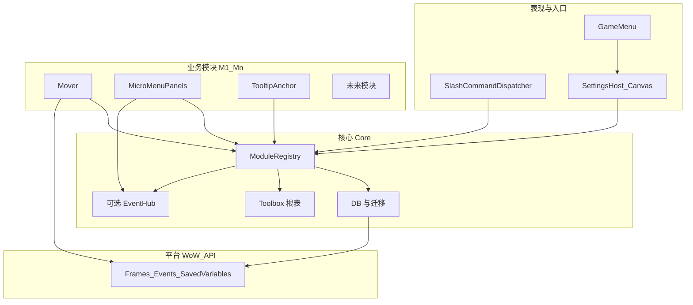
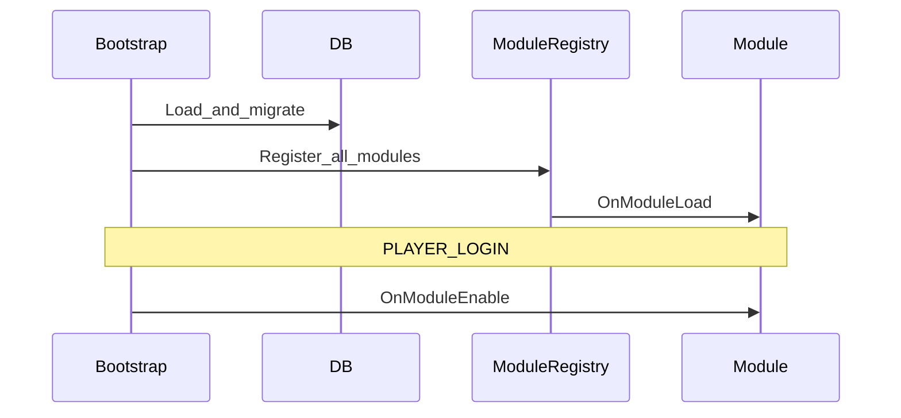

# 魔兽世界正式服 · 工具箱插件技术方案

本文档汇总当前共识，作为实现与扩展的单一事实来源（随开发可修订版本号与细节）。

---

## 1. 目标与范围

| 维度 | 说明 |
|------|------|
| **定位** | 单插件「工具箱」：统一入口、可扩展模块、统一存档与设置 UI。 |
| **客户端** | **仅正式服（Retail）**，以 `Settings` API 与当前 Interface 版本为准。 |
| **初版能力** | ① **模块 `mover`**：本插件自建 `Frame`（`Toolbox.Mover.RegisterFrame`）+ 可选 **暴雪顶层窗口**（默认经 `ShowUIPanel` 挂标题栏拖动，类 BlizzMove；内置名单 + 额外 Frame 名；商城等受保护界面排除；**不**移动微型按钮条本身）；② ESC 游戏菜单 + 系统「选项」中的插件类目入口；③ Tooltip 锚点（见 **TooltipAnchor**）。 |
| **扩展方式** | 新功能 = 新模块文件 + `RegisterModule` + TOC 加载顺序；核心保持稳定，业务只增模块。 |

---

## 2. 整体架构（鸟瞰）

```
Core（薄层）
├── 根命名空间（如 Toolbox）
├── SavedVariables 加载 / 版本迁移
├── **Chat（领域对外 API）** — 默认聊天框输出、TOC 元数据读取；见 `Core/API/Chat.lua`
├── **Tooltip（领域对外 API）** — `GameTooltip_SetDefaultAnchor` hook 与光标锚点；见 `Core/API/Tooltip.lua`
├── ModuleRegistry（注册、排序、生命周期）
└── 可选：轻量事件（模块增多后再评估 EventHub）

Modules（平级业务，持续增加）
├── Mover — 插件自有 Frame
├── （兼容）MicroMenuPanels.lua — 旧 API 委托给 Mover，不再单独 `RegisterModule`
├── MinimapButton — 小地图旁打开 Toolbox 设置的按钮（可单独隐藏）；悬停展开纵向操作列，`Toolbox.MinimapButton.RegisterFlyoutEntry` 供其它模块追加项
├── TooltipAnchor — GameTooltip 等锚点/跟随鼠标

UI
├── SettingsHost — Retail Canvas 主类目总览页 + 各功能真实子页面 + 关于页
└── GameMenu — 按钮 → Settings.OpenToCategory（与选项中入口一致）
```

**原则**：可扩展能力经 `RegisterModule` 进入；持久化落在 `ToolboxDB.modules[moduleId]`；设置页由宿主统一渲染公共区，再由各模块补自己的专属设置区。

**本地环境隔离原则（强制）**：严禁在任何仓库文件（包括 `.md`、`.ps1`、`.lua`、`.toc`、脚本等）中硬编码开发者个人的**本地路径、盘符、用户名、机器特定配置**。所有路径相关配置必须通过**环境变量**（如 `WOW_RETAIL_ADDONS`）、命令行参数、或运行时自动探测实现。违反此原则的修改一律回滚或拒绝。

**代码注释**：新增/修改的 Lua 须含文件头与关键逻辑注释（动机、暴雪限制、Frame 名与数据键）；**注释使用简体中文**；细则见 [AGENTS.md](../AGENTS.md)。

**全球化（界面文案）**：玩家可见字符串集中在 [Toolbox/Core/Foundation/Locales.lua](../Toolbox/Core/Foundation/Locales.lua)，按 `GetLocale()` 在 `enUS` 与 `zhCN`（及 `zhTW` 暂跟简体）间切换；模块注册使用 `nameKey` 指向 `Toolbox.L` 键名，设置界面与 `RegisterCanvasLayoutCategory` 标题均走 `Toolbox.L`。

**协作与需求确认**：见 [AGENTS.md](../AGENTS.md)「AI 行为规则」与 [AI-ONBOARDING.md](./AI-ONBOARDING.md)。

---

## 2.1 通用架构：分层与扩展点

面向「不断加新功能」，约定四层，依赖只允许 **自上而下**（上层依赖下层，同层模块不互相 `require` 实现细节，而通过 **核心 API + 可选事件** 协作）。



| 层级 | 职责 | 稳定性 |
|------|------|--------|
| **平台** | Blizzard API，不封装成全量抽象，仅在模块内直接使用 | 随版本变 |
| **核心** | 命名空间、SV、迁移、`RegisterModule`、生命周期、（可选）事件 | **尽量少改** |
| **模块** | 单一业务域，可启用/禁用、自有子配置 | **主要增量在这里** |
| **表现** | 统一设置壳、GameMenu、Slash 分发，不包含业务判断 | 随入口 API 偶发调整 |

**Lua 实现约定**：文件路径与 TOC、优先 `local`、注释与对外接口文档、`ToolboxDB` 键边界、`pcall` 与 `nil` 等编码细则，以仓库根 **[AGENTS.md](../AGENTS.md)** 中 **「Lua 开发规范」** 为准；本节只描述架构分层，不重复上述条款。

**核心扩展点（新功能应挂接的位置）**

| 扩展点 | 用途 | 约定 |
|--------|------|------|
| `RegisterModule(def)` | 接入新业务能力 | 必须提供稳定 `id`；禁止在 def 里写死其他模块全局 |
| `ToolboxDB.modules[id]` | 模块私有数据 | 键名由模块独占；跨模块共享数据走明确 API 或后续 EventHub |
| `RegisterSettings` | 在系统设置里增加模块专属 UI | 只注册本模块专属设置区，不重复实现公共启用/调试/重建区 |
| Slash 分发器 | `/toolbox` 子命令 | 模块可注册 `subcommands["foo"] = handler`，避免每个模块抢一个全局 slash |
| `hooksecurefunc` 等 | 模块内部自行使用；**Tooltip 默认锚点**已集中在 `Core/API/Tooltip.lua` | 与领域对外 API 重复的 hook 应经 `Toolbox.Tooltip` 统一提供；其它仍可在模块内使用 |

**领域对外 API（与 [AGENTS.md](../AGENTS.md) 一致）**

| 领域对外 API | 文件 | 职责 |
|------|------|------|
| `Toolbox.Chat` | `Core/API/Chat.lua` | 面向玩家的默认聊天框输出（`PrintAddonMessage`）、插件 TOC 元数据（`GetAddOnMetadata`）。**模块内禁止**直接调用 `DEFAULT_CHAT_FRAME:AddMessage`；新增聊天类能力须先扩展本 API。 |
| `Toolbox.Tooltip` | `Core/API/Tooltip.lua` | `InstallDefaultAnchorHook()`、`RefreshDriver()`；读取 `modules.tooltip_anchor`。**模块 tooltip_anchor** 仅负责 `RegisterModule` 与设置 UI，不直接 `hooksecurefunc` GameTooltip。 |
| `Toolbox.Lockouts` | `Core/API/Lockouts.lua` | 锁定列表：`GetNumSavedInstances` / `GetSavedInstanceInfo` 等封装（至暗之夜仍以此为主流 API，便于日后替换）。 |
| `Toolbox.EJ` | `Core/API/EncounterJournal.lua` | **优先 `C_EncounterJournal`**，兜底时再考虑全局 `EJ_*`；业务模块禁止直接调用 `EJ_*`。含 `SetDifficulty` / `IsValidInstanceDifficulty` 等；副本列表语境以 `EncounterJournal.selectedTab` 与 `GetEncounterJournalInstanceListButtonIds` 为准（与 `GetJournalTabId` 可能不是同一套数字）。 |
| `Toolbox.MountJournal` | `Core/API/MountJournal.lua` | `C_MountJournal`（坐骑物品、是否已学会）。 |
| `Toolbox.Item` | `Core/API/Item.lua` | 物品名/链接、`GameTooltip:SetItemByID` 等展示辅助。 |
| `Toolbox.Map` | `Core/API/Map.lua` | `C_Map.OpenWorldMap` 优先。 |
| `Toolbox.MinimapButton` | `Modules/MinimapButton.lua` | `RegisterFlyoutEntry(def)` 供其他模块向小地图按钮悬停菜单追加项；`def` 至少包含 `id` 与 `onClick`，可选 `titleKey`/`tooltipKey`/`icon`/`order`/`augmentTooltip`（用于在悬停提示中追加动态内容）。禁止直接操作 `flyoutRegistry` 或 `flyoutSlotIds`。 |

**模块间协作原则**

- **默认零耦合**：新模块不 import 其他模块文件；若 A 依赖 B 的「结果」，优先 **依赖注入顺序**（`dependencies`）+ B 在 `Toolbox` 上暴露少量函数（如 `Toolbox.Mover:GetFrameRegistry()`），仍由核心在注册阶段绑定。
- **可选 EventHub**：当出现「多个模块要响应同一事实」（例如「全局 UI 缩放变更」）时，由核心提供 `Toolbox:Emit(name, payload)` / `Subscribe`，**第一版可不实现**，避免过度设计。

**模块类型（便于评审新需求落在哪一类）**

| 类型 | 特征 | 示例 |
|------|------|------|
| **自有 UI** | 只操作插件创建的 Frame | Mover 等 |
| **暴雪 UI 适配** | 白名单 / ShowUIPanel + Hook + 战斗中谨慎 | Mover（暴雪部分）、TooltipAnchor |
| **纯逻辑/数据** | 无窗体或仅有轻量提示 | 未来：统计、导出配置 |

**生命周期（统一顺序）**

1. `ADDON_LOADED`：加载 DB 默认值 → 迁移 → `ModuleRegistry` 收集全部 `RegisterModule`。
2. 按 `dependencies` **拓扑排序**，依次调用各模块 `OnModuleLoad`。
3. `PLAYER_LOGIN`（或等价）后依次 `OnModuleEnable`。
4. `Settings` 类目在 `OnModuleLoad` 阶段由各模块 `RegisterSettings` 向宿主 **登记**，宿主在首次打开前构建子区域。



**版本与兼容**

- **全局 `ToolboxDB.version`**：结构大变时递增；迁移函数集中在 `Core/Config.lua`。
- **模块内可设 `schemaVersion`**（存在 `modules[id].schemaVersion`）：模块自身大改时自行迁移子表，避免动全局版本过于频繁。

---

## 2.2 现有功能与模块映射

| 能力 | 模块 id（建议） | 数据 | 设置 |
|------|-----------------|------|------|
| 窗口拖动（自建 + 可选暴雪） | `mover` | `modules.mover`（`enabled`/`debug`/`frames`/`blizzardDragHitMode`/`allowDragInCombat`）；旧 `micromenu_panels.frames` 一次性迁入 `mover` | 独立子页面：启用、调试、清理并重建、拖动命中模式、战斗中是否允许拖；暴雪顶层仅代码内 `PANEL_KEYS` |
| Tooltip 锚点 | `tooltip_anchor` | `modules.tooltip_anchor`（`enabled`/`debug`/`mode`/`offsetX`/`offsetY`） | 独立子页面：启用、调试、清理并重建、锚点模式与偏移 |
| 小地图打开设置按钮 | `minimap_button` | `modules.minimap_button`（`enabled`/`debug`/`showMinimapButton`/`minimapPos`/`buttonShape`/`flyoutExpand`/`flyoutSlotIds`/`flyoutLauncherGap`/`flyoutPad`/`flyoutGap`） | 独立子页面：启用、调试、清理并重建、是否显示小地图按钮、恢复默认位置；款式（圆/方）、展开方式（纵向/横向）、悬停项顺序与功能池拖放、`flyoutSlotIds`；预览区为居中微缩按钮 + 展开示意（缝宽/内边距/项间距拖动，非游戏内角度）；游戏内沿小地图边缘拖动定角；悬停向左展开（扩展见 `RegisterFlyoutEntry`）；内置“冒险手册”悬停项通过 `augmentTooltip` 追加当前副本锁定摘要。 |
| 加载聊天提示 | `chat_notify` | `modules.chat_notify`（`enabled`/`debug`） | 独立子页面：启用、调试、清理并重建、说明文案 |
| 地下城 / 团队副本共享目录页面与开关 | `dungeon_raid_directory` | `modules.dungeon_raid_directory`（`enabled`/`debug`）+ `global.dungeonRaidDirectory`（`schemaVersion` / `interfaceBuild` / `lastBuildAt` / `tierNames` / `difficultyMeta` / `records`） | 独立子页面：启用、调试、清理并重建、状态、进度、手动重建、调试快照 |
| 冒险指南仅坐骑筛选 | `ej_mount_filter` | `modules.ej_mount_filter`（`enabled`/`debug`）；掉落判断统一读取 `global.dungeonRaidDirectory.records[*].summary`，并允许目录层按名称补源已知假阴性；仅当**当前页签 + 当前资料片**下全部副本摘要就绪时才启用复选框，勾选后由覆盖列表接管显示 | 冒险手册内复选框 + 独立设置子页面 |
| （核心不提供业务数据） | — | `global` 其余键 | 调试、开发者选项可放 `global` |

新增功能时：**新增一行 + 新文件 + TOC 一条**，不必改核心契约。

---

## 3. 数据模型（SavedVariables）

单表建议结构：

```lua
ToolboxDB = {
  version = <number>,   -- 全局迁移版本
  global = {
    debug = false,
    locale = "auto",  -- locale：auto | zhCN | enUS，见 Locales.lua
    dungeonRaidDirectory = { ... },
  },
  modules = {
    mover = { enabled = true, debug = false, ... },
    micromenu_panels = { enabled = true, debug = false, ... },
    tooltip_anchor = { enabled = true, debug = false, ... },
    minimap_button = { enabled = true, debug = false, showMinimapButton = true, minimapPos = nil, buttonShape = "round", flyoutExpand = "vertical", flyoutSlotIds = { "reload_ui" }, flyoutLauncherGap = 0, flyoutPad = 4, flyoutGap = 0 },
    chat_notify = { enabled = true, debug = false, ... },
    dungeon_raid_directory = { enabled = true, debug = false },
    ej_mount_filter = { enabled = false, debug = false },
  },
}
```

- 各模块 **只读写** `ToolboxDB.modules.<自身 id>`，避免键冲突。
- 大版本或结构变更时递增 `version`，在核心内做迁移函数表。
- **旧存档**：可能含已下线模块的键；`Core/Config.lua` 的 `defaults` 仅描述当前版本默认形状，合并时不强制删除用户表中多余键。

### SavedVariables 迁移规范

- **每次改动 `ToolboxDB` 结构**（新增键、重命名、移除）必须在 `Core/Config.lua` 的 `DB.Init()` 中写对应迁移代码。
- **迁移逻辑必须幂等**：重复执行结果不变；用 nil 检查或专用 `_migrated` 标记防止重跑。
- **废弃键在同次迁移中置 nil**：不留到"下次再清"——旧键会永久占用玩家的 SavedVariables 文件。
- **`ToolboxDB.version`** 用于不可幂等的一次性结构重命名；每次此类迁移时递增，并在 `ver < N` 块中执行；已迁移的 SV 不会重跑。
- **模块级迁移**：字段范围较小的迁移可在 `DB.Init()` 单独的 `do…end` 块中处理，无需递增全局 `version`（见 `ej_mount_filter.debugChat → debug`、`mover._micromenuMerged` 等现有模式）。
- **禁止在模块文件顶层**（非函数体内）读写 `ToolboxDB`：SavedVariables 在 `ADDON_LOADED` 之后才可用，顶层执行时 `ToolboxDB` 可能仍是 `nil`。

### Settings API 注册规范

- `Settings.RegisterCanvasLayoutCategory` / `RegisterCanvasLayoutSubcategory` 只能在 `ADDON_LOADED` 或之后调用；禁止在模块文件顶层（脚本执行阶段）调用。
- 子页面**必须通过 `SettingsHost:Build()` 统一注册**；禁止模块自行调用 `RegisterCanvasLayoutSubcategory`，以保证顺序（`settingsOrder`）与公共区（启用/调试/重置）一致性。
- `RegisterSettings(box)` 回调**只负责绘制控件**；不得在此回调中修改 `ToolboxDB`（修改应在 `OnClick` / `OnValueChanged` 等用户交互回调里）。**允许读取**：从 `ToolboxDB.modules.<id>` 读取已有值以设置控件初始状态（如 `checkbox:SetChecked(db.enabled)`）是允许的。
- **`box.realHeight` 必须在 `RegisterSettings` 末尾赋值**（`SettingsHost` 据此决定滚动区高度）；遗漏时内容会被截断且无报错。

---

## 4. 模块契约（RegisterModule）

每个模块建议提供：

| 字段 | 说明 |
|------|------|
| `id` | 稳定字符串，作 DB 键与设置子区 id |
| `name` | 可选，固定显示名（不推荐；优先 `nameKey`） |
| `nameKey` | 可选，`Toolbox.L` 中的键，用于设置页模块标题（多语言） |
| `settingsIntroKey` | 可选，模块子页面简介文案键 |
| `settingsOrder` | 可选，模块子页面顺序（越小越靠前） |
| `dependencies` | 可选，模块 id 列表；核心按拓扑排序初始化 |
| `OnModuleLoad` | 不依赖角色数据的初始化 |
| `OnModuleEnable` | `PLAYER_LOGIN` 后执行（读角色、应用 UI） |
| `RegisterSettings` | 向 Settings 宿主注册本模块**专属**配置 UI |
| `OnEnabledSettingChanged` | 公共启用开关变化后，模块立即重应用当前状态 |
| `OnDebugSettingChanged` | 公共调试开关变化后，模块同步内部调试行为 |
| `ResetToDefaultsAndRebuild` | 公共“清理并重建”入口；恢复默认值并立刻重新应用 |
| `OnProfileChanged` | 可选 |

---

## 5. 功能方案分述

### 5.1 设置与 ESC 入口（Retail）

- 使用 **`Settings.RegisterCanvasLayoutCategory` + `Settings.RegisterCanvasLayoutSubcategory` + `Settings.RegisterAddOnCategory`** 注册 `Toolbox` 主类目总览页与各功能真实子页面。
- **游戏菜单**：在 `GameMenuFrame` 上增加按钮，点击调用 **`Settings.OpenToCategory(categoryID)`**，与 **ESC → 选项 → 插件** 中打开的界面一致；挂载时机见 **`Toolbox.GameMenu_Init`**（`ADDON_LOADED`、`PLAYER_ENTERING_WORLD`、`OnShow`），不以固定秒数延迟为主路径。
- 提供 **`/toolbox`**（或约定 slash）便于调试与无菜单时打开。
- **页面结构**：`Toolbox` 主类目页负责总览、语言与重载入口；各功能页统一由宿主绘制简介、启用、调试、清理并重建，再由模块补自己的专属设置区；“关于”作为单独子页面存在。

### 5.2 自有窗口拖动（Mover）

- 对插件创建的 `Frame`：`SetMovable(true)`、`RegisterForDrag`、存盘键与 `ToolboxDB.modules.mover` 对应。
- 拖动建议绑在 **标题栏或专用手柄**，避免与窗体内按钮抢拖动；可配置战斗中禁止拖动（视框体是否含安全逻辑而定）。

### 5.3 暴雪游戏界面窗口拖动（并入模块 `mover`）

| 项 | 说明 |
|----|------|
| **目标** | 对经 **`ShowUIPanel`** 打开的 **顶层** 面板挂标题栏拖动与位置记忆（效果接近 BlizzMove）；**不包含**右下角微型按钮条本身。 |
| **原理** | **移动对象**须为要记位置的 **UIPanel 根 Global**。受 `UIPanelWindows` / FramePositionManager 管理的窗口若仅用 `StartMoving`，易被每帧重锚抵消；故挂接时 **临时从面板管线剥离**（思路参考 MoveAnything `Position`：`ignoreFramePositionManager`、`UIPanelWindows` / `UIPanelLayout`），位移用 **光标 delta + `SetPoint`(TOPLEFT 相对 `UIParent`)**。**拖动条**须为可命中的 Region：`RegisterForDrag` 挂其上；大地图等解析顺序见 `Modules/Mover.lua` 中 `resolveBlizzardDragRegion`。 |
| **实现** | `hooksecurefunc("ShowUIPanel", …)` 为主；`HideUIPanel` 后及 **`C_Timer.After(0)`** 做**下一帧合并**（避免连续 `ClearAllPoints` 闪烁）；**`After(0.06)`** 仅作为 ShowUIPanel hook 之后的补正（抵消多面板重排），须在注释中写明依据，且必须有 OnShow / hooksecurefunc 等正式路径作为主路径，不得单独作为等布局的唯一手段（见 AGENTS.md「暴雪 UI 挂接时机」）；`PANEL_KEYS` + `HookScript("OnShow")` 重挂；`ADDON_LOADED` / `PLAYER_ENTERING_WORLD` 补挂懒加载；**`hooksecurefunc("ToggleWorldMap")`**、`OpenWorldMap` / 任务日志相关 hook 与 `WorldMapFrame` OnShow 互补。排除名单（如 `StoreFrame`、`GameMenuFrame`、`SettingsPanel`）不挂接。详细因果见 **`Modules/Mover.lua`**。 |
| **名单** | 懒加载补挂与 `tryHookPendingPanels` 仅遍历 `PANEL_KEYS`；`ShowUIPanel` hook 仍可为其它合法顶层名挂接。全局名可用 `/fstack` 对照。旧 `micromenu_panels.frames` 迁入 `modules.mover`。内置含 **`WorldMapFrame`**（大地图 + 任务侧栏；**`QuestMapFrame` 为子 Frame**，勿单独当顶层）、**`QuestFrame`**（NPC 任务窗）等。 |
| **拖动条解析** | 统一顺序：`TitleContainer` → **`BorderFrame.TitleContainer`** →（仅 `WorldMapFrame`）**`TitleCanvasSpacerFrame`** 兜底 → **`BorderFrame`** → 根。 |
| **战斗** | `InCombatLockdown` 下不开始拖动（与 §5.2 一致）。 |
| **受保护界面** | 内置排除名单（商城、`GameMenuFrame`、`SettingsPanel` 等）不挂接：勿对 ESC 菜单与系统选项顶层做管线剥离，否则战斗中易出现菜单/设置无法操作。无额外冲突检测或用户「修复」选项。 |

### 5.4 Tooltip 锚点（TooltipAnchor + `Toolbox.Tooltip`）

| 项 | 说明 |
|----|------|
| **目标** | 调整 `GameTooltip` / `ItemRefTooltip` 相对鼠标的显示方式（贴近光标、显示期间跟随；锚在光标右下等）。 |
| **领域对外 API** | `Core/Tooltip.lua`：`InstallDefaultAnchorHook()`（`hooksecurefunc("GameTooltip_SetDefaultAnchor", ...)`）、`RefreshDriver()`（跟随用 `OnUpdate`）。**勿在 OnUpdate 里 `SetOwner`**，否则会清空提示文字。 |
| **模块** | `tooltip_anchor`：设置 UI 与存档键；调用 `Toolbox.Tooltip` 的 `InstallDefaultAnchorHook` / `RefreshDriver`。 |
| **注意** | `UIParent:GetEffectiveScale()`；与暴雪「界面·鼠标」类选项可能叠加。 |

### 5.5 聊天（Chat）领域对外 API 与加载提示（chat_notify）

| 项 | 说明 |
|----|------|
| **领域对外 API** | `Toolbox.Chat`（`Core/Chat.lua`）：`PrintAddonMessage(body)`、`GetAddOnMetadata(name, field)`。 |
| **模块** | `chat_notify`：是否输出、旧档迁移、`Locales` 文案键；`PrintLoadComplete()` 组装正文后调用 `Toolbox.Chat.PrintAddonMessage`。 |
| **调用时机** | `Core/Bootstrap.lua` 在 `ADDON_LOADED` 主流程末尾（DB、语言、模块 OnModuleLoad、设置 UI、斜杠注册之后）调用 `PrintLoadComplete()`，避免 `OnModuleLoad` + `C_Timer` 间接触发。 |

---

## 6. TOC 与加载顺序（建议）

1. `Core/Foundation/Namespace.lua` — 根表  
2. `Core/Foundation/Locales.lua` — `Toolbox.L` 多语言（须在 Settings 与 Modules 之前）  
3. `Core/Foundation/Config.lua` — 默认表、迁移  
4. `Core/API/Chat.lua` — 聊天领域对外 API  
5. `Core/API/Tooltip.lua` — 提示框领域对外 API（须在 `Modules/TooltipAnchor.lua` 之前）  
6. `Core/API/Lockouts.lua`、`Core/API/EncounterJournal.lua`、`Core/API/MountJournal.lua`、`Core/API/Item.lua`、`Core/API/Map.lua` — 领域对外 API
7. `Core/Foundation/ModuleRegistry.lua`
8. `UI/SettingsHost.lua`
9. `Modules/Mover.lua`、`Modules/MicroMenuPanels.lua`（兼容委托，无 `RegisterModule`）、`Modules/TooltipAnchor.lua`、`Modules/ChatNotify.lua`（顺序可按依赖微调）
10. `Core/Foundation/Bootstrap.lua` — `ADDON_LOADED` 中初始化并启用模块

`## Interface:` 与正式服客户端一致，大版本后更新。

---

## 7. 里程碑建议

1. TOC + Bootstrap + `ToolboxDB` + `/toolbox` + 空 Settings 类目可打开。  
2. Mover：自建窗通过 `RegisterFrame` 可拖、可存。  
3. GameMenu 按钮跳转同一类目。  
4. Mover：可选暴雪窗（ShowUIPanel）+ 存盘 + 设置。  
5. TooltipAnchor：默认锚点 Hook + 设置项（模式与偏移）；按需加 ShoppingTooltip。

---

## 8. 风险与边界

- **不承诺**移动「所有」暴雪 UI；本方案仅 **微型菜单打开的面板白名单**。  
- **世界距离、Tab 目标、姓名板射线** 等不在本插件能力范围内（非本插件目标）。  
- 暴雪重命名 Frame 时需更新白名单；建议在设置中提供「本模块版本说明」或调试日志。

---

## 9. 文档修订

| 日期 | 修订内容 |
|------|----------|
| 2026-04-01 | 初稿：Retail、框架、四块能力、微型菜单仅面板不拖按钮 |
| 2026-04-01 | 通用可扩展架构：分层、扩展点、生命周期、模块映射；增加 TooltipAnchor 与里程碑 |
| 2026-04-01 | 代码注释约束：见 AGENTS.md；总设计「原则」下增加链接 |
| 2026-04-01 | Locales.lua 全球化；注释限定中文；模块 nameKey；TOC 插入 Locales |
| 2026-04-02 | 领域对外 API `Toolbox.Chat`（Core/Chat.lua）；chat_notify 仅经 `Toolbox.Chat`；TOC 与 §5.6 补充 |
| 2026-04-02 | 领域对外 API `Toolbox.Tooltip`（Core/Tooltip.lua）；tooltip_anchor 变薄；MicroMenuPanels 统一 `getMicroMenuDb()` |
| 2026-04-02 | Core 下锁定/手册/坐骑/物品/地图分别置于 `Lockouts.lua`、`EncounterJournal.lua`、`MountJournal.lua`、`Item.lua`、`Map.lua`；物品对外 API 为 `Toolbox.Item`；文档用语统一为「领域对外 API」 |
| 2026-04-02 | §5.1 指向 `specs/2026-04-02-design-workflow-and-settings-groups.md`（协作节奏 + 设置页可折叠分组设计草案） |
| 2026-04-02 | §2.1 增加对 [AGENTS.md](../AGENTS.md)「Lua 开发规范」的引用 |
| 2026-04-02 | 鸟瞰图与 §2.2、§3：移除已不存在的 `saved_instances` 模块描述；§3 示例与旧存档说明 |
| 2026-04-02 | §1 原则区增加「协作与需求确认」：指向 AI-ONBOARDING §1.2 硬约束与 AGENTS 模糊需求清单 |
| 2026-04-03 | 移除未契约化的冒险手册「仅坐骑」实现（原 `SavedInstancesEJ.lua` / `global.ejMountFilter`）；重做方案见 [specs/2026-04-03-adventure-guide-mount-filter-lockout-redesign.md](./specs/2026-04-03-adventure-guide-mount-filter-lockout-redesign.md)，待开动后按模块模型落地 |
| 2026-04-03 | 落地 `ej_mount_filter`：`Modules/EJMountFilter.lua`；规格 [superpowers/specs/2026-04-03-ej-mounts-only-filter-design.md](./superpowers/specs/2026-04-03-ej-mounts-only-filter-design.md) |
| 2026-04-03 | 新增 `Toolbox.DungeonRaidDirectory`：`Core/DungeonRaidDirectory.lua` + `global.dungeonRaidDirectory`；`ej_mount_filter` 改为消费共享目录摘要，Settings 增加缓存状态 / 进度 / 重建入口 / 调试快照查看器 |
| 2026-04-03 | §1「协作与需求确认」补充：数据来源/主方案未分叉前不得以「是否实现」收尾；指向 AI-ONBOARDING §1.2「防未选定主方案就问是否实现」 |
| 2026-04-04 | `DungeonRaidDirectory` 调整为登录后预热缓存；玩家浏览冒险手册地下城 / 团队副本列表时暂停后台扫描，离开后恢复；`ej_mount_filter` 在当前列表摘要未全部就绪前置灰，数据层可按名称补源已知假阴性，筛选显示改为覆盖列表以避开原生分页与空槽位问题；目录构建调度改为“当前资料片优先，其余后台补齐”，且单副本命中坐骑后停止扫描剩余难度 |
| 2026-04-04 | 设置页重构为 `Toolbox` 主类目总览页 + 各功能真实子页面 + 关于页；模块统一采用 `enabled/debug` 公共键与公共“清理并重建”入口；新增 `Modules/DungeonRaidDirectory.lua` 承接共享目录的设置页型模块 |
| 2026-04-04 | §1、§5.3：区分 **`mover`（本插件窗体 + `RegisterFrame`）** 与 **`micromenu_panels`（暴雪白名单）**；白名单说明以 `PANEL_KEYS` 为准并写明商城不纳入；补充拖动挂点（TitleContainer）与战斗限制 |
| 2026-04-04 | 暴雪窗口拖动并入 **`mover`**：`ShowUIPanel` 全局挂接 + 原懒加载补挂；`micromenu_panels` 存档迁移；`MicroMenuPanels.lua` 兼容委托 |
| 2026-04-05 | 规范重构：三关关 3 触发条件精确化（移除「新 ToolboxDB 键」）；RegisterSettings 补充允许读取存档值；§5.3 After(0.06) 加限制条件；§2.1 领域对外 API 表补充 `Toolbox.MinimapButton.RegisterFlyoutEntry`；§3 补充账号级 vs 角色级存档约定 |
| 2026-04-08 | 小地图悬停菜单增强：内置“冒险手册”项在 tooltip 中追加当前副本锁定摘要（实例/难度/重置时间，团队本含进度）；`Toolbox.EJ` 增加锁定摘要与 tooltip 行构建接口 |
