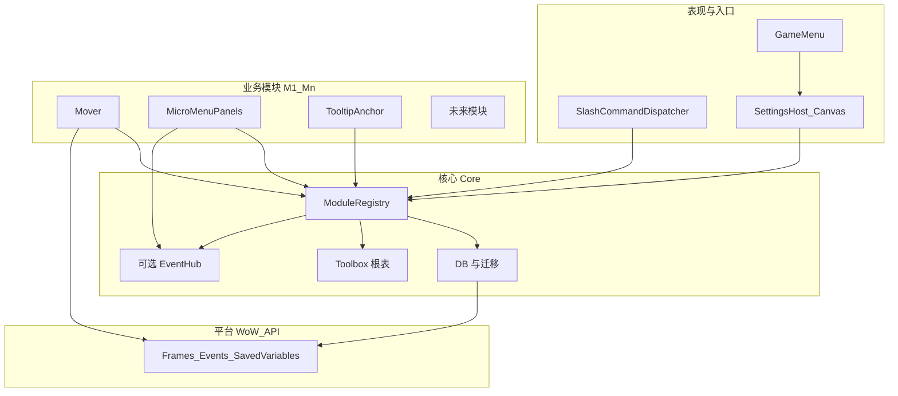
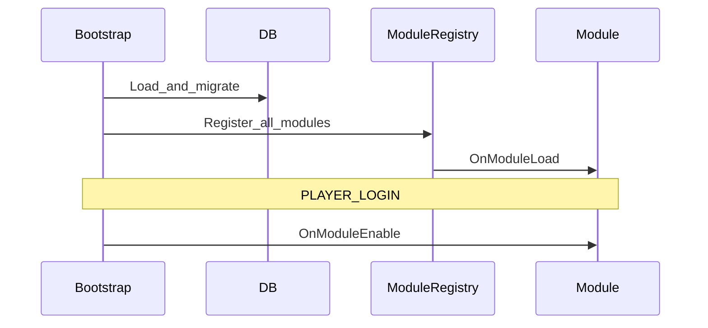

# 魔兽世界正式服 · 工具箱插件技术方案

本文档汇总当前共识，作为实现与扩展的单一事实来源（随开发可修订版本号与细节）。

---

## 1. 目标与范围

| 维度 | 说明 |
|------|------|
| **定位** | 单插件「工具箱」：统一入口、可扩展模块、统一存档与设置 UI。 |
| **客户端** | **仅正式服（Retail）**，以 `Settings` API 与当前 Interface 版本为准。 |
| **当前能力** | ① **模块 `mover`**：插件自建窗体与可选暴雪顶层窗口拖动；② **模块 `tooltip_anchor`**：Tooltip 锚点与跟随模式；③ **模块 `chat_notify`**：统一加载提示；④ **模块 `minimap_button`**：小地图按钮与飞出菜单；⑤ **模块 `encounter_journal`**：冒险指南副本列表增强、详情页增强、入口导航与锁定摘要联动；⑥ **模块 `quest`**：独立任务界面、任务浏览与 Quest Inspector；⑦ **模块 `navigation`**：地图导航当前基线，路线图按当前角色配置和最少路径步数计算；V1 以 `taxi / hearthstone / class_teleport / class_portal / walk_local` 为主闭环，世界地图“规划路线”按钮与顶部路径 UI 已接入，且导航运行时数据只允许由 DataContracts 导出；⑧ ESC 游戏菜单 + 系统「选项」中的插件类目入口。 |
| **扩展方式** | 新功能 = 新模块文件 + `RegisterModule` + TOC 加载顺序；核心保持稳定，业务只增模块。 |

---

## 2. 整体架构（鸟瞰）

```
Core（薄层）
├── 根命名空间（如 Toolbox）
├── Runtime / SavedVariables 加载 / 版本迁移
├── **Chat（领域对外 API）** — 默认聊天框输出、TOC 元数据读取；见 `Core/API/Chat.lua`
├── **Tooltip（领域对外 API）** — `GameTooltip_SetDefaultAnchor` 默认锚点 hook 与 tooltip 鼠标附近显示策略；见 `Core/API/Tooltip.lua`
├── **EJ（领域对外 API）** — 冒险指南锁定、坐骑掉落、入口导航与锁定摘要；见 `Core/API/EncounterJournal.lua`
├── **Questlines（领域对外 API）** — 任务线静态模型、任务线显示名解析与运行时任务字段；见 `Core/API/QuestlineProgress.lua`
├── **Navigation（领域对外 API）** — 统一路线图、当前角色可用性过滤、能力模板展开与最少步数求解；见 `Core/API/Navigation.lua`
├── ModuleRegistry（注册、排序、生命周期）
└── 可选：轻量事件（模块增多后再评估 EventHub）

Modules（平级业务，持续增加）
├── Mover — 插件自有 Frame
├── （兼容）MicroMenuPanels.lua — 旧 API 委托给 Mover，不再单独 `RegisterModule`
├── ChatNotify — 默认聊天框加载提示
├── MinimapButton — 小地图旁打开 Toolbox 设置的按钮（可单独隐藏）；悬停展开纵向操作列，内置“冒险手册”“任务”等飞出项
├── TooltipAnchor — GameTooltip 等锚点/跟随鼠标
├── EncounterJournal — 冒险指南副本列表增强、详情页增强、入口导航与锁定摘要联动
├── Navigation — 地图导航模块，世界地图“规划路线”按钮、路径核心、地图节点契约数据、统一路线边导出和顶部路径 UI 已接入；运行时数据只允许来自 DataContracts 导出
└── Quest — 独立任务界面、任务浏览、最近完成与 Quest Inspector

UI
├── SettingsHost — Retail Canvas 主类目总览页 + 各功能真实子页面 + 关于页
└── GameMenu — 按钮 → Settings.OpenToCategory（与选项中入口一致）
```

**原则**：可扩展能力经 `RegisterModule` 进入；持久化落在 `ToolboxDB.modules[moduleId]`；设置页由宿主统一渲染公共区，再由各模块补自己的专属设置区。

**本地环境隔离原则（强制）**：严禁在任何仓库文件（包括 `.md`、`.ps1`、`.lua`、`.toc`、脚本等）中硬编码开发者个人的**本地路径、盘符、用户名、机器特定配置**。所有路径相关配置必须通过**环境变量**（如 `WOW_RETAIL_ADDONS`）、命令行参数、或运行时自动探测实现。违反此原则的修改一律回滚或拒绝。

**代码注释**：新增/修改的 Lua 须含文件头与关键逻辑注释（动机、暴雪限制、Frame 名与数据键）；**注释使用简体中文**；细则见 [AGENTS.md](../AGENTS.md)。

**全球化（界面文案）**：玩家可见字符串集中在 [Toolbox/Core/Foundation/Locales.lua](../Toolbox/Core/Foundation/Locales.lua)，按 `GetLocale()` 在 `enUS` 与 `zhCN`（及 `zhTW` 暂跟简体）间切换；模块注册使用 `nameKey` 指向 `Toolbox.L` 键名，设置界面与 `RegisterCanvasLayoutCategory` 标题均走 `Toolbox.L`。

**协作与需求确认**：见 [AGENTS.md](../AGENTS.md)「AI 行为规则」与 [AI-ONBOARDING.md](./AI-ONBOARDING.md)。

---

## 2.1 通用架构：分层与扩展点

面向「不断加新功能」，约定四层，依赖只允许 **自上而下**（上层依赖下层，同层模块不互相 `require` 实现细节，而通过 **核心 API + 可选事件** 协作）。



| 层级 | 职责 | 稳定性 |
|------|------|--------|
| **平台** | Blizzard API，不封装成全量抽象，仅在模块内直接使用 | 随版本变 |
| **核心** | 命名空间、SV、迁移、`RegisterModule`、生命周期、（可选）事件 | **尽量少改** |
| **模块** | 单一业务域，可启用/禁用、自有子配置 | **主要增量在这里** |
| **表现** | 统一设置壳、GameMenu、Slash 分发，不包含业务判断 | 随入口 API 偶发调整 |

**Lua 实现约定**：文件路径与 TOC、优先 `local`、注释与对外接口文档、`ToolboxDB` 键边界、`pcall` 与 `nil` 等编码细则，以仓库根 **[AGENTS.md](../AGENTS.md)** 中 **「Lua 开发规范」** 为准；本节只描述架构分层，不重复上述条款。

**核心扩展点（新功能应挂接的位置）**

| 扩展点 | 用途 | 约定 |
|--------|------|------|
| `RegisterModule(def)` | 接入新业务能力 | 必须提供稳定 `id`；禁止在 def 里写死其他模块全局 |
| `ToolboxDB.modules[id]` | 模块私有数据 | 键名由模块独占；跨模块共享数据走明确 API 或后续 EventHub |
| `RegisterSettings` | 在系统设置里增加模块专属 UI | 只注册本模块专属设置区，不重复实现公共启用/调试/重建区 |
| Slash 分发器 | `/toolbox` 子命令 | 模块可注册 `subcommands["foo"] = handler`，避免每个模块抢一个全局 slash |
| `hooksecurefunc` 等 | 模块内部自行使用；**Tooltip 默认锚点**已集中在 `Core/API/Tooltip.lua` | 与领域对外 API 重复的 hook 应经 `Toolbox.Tooltip` 统一提供；其它仍可在模块内使用 |

**领域对外 API（与 [AGENTS.md](../AGENTS.md) 一致）**

| 领域对外 API | 文件 | 职责 |
|------|------|------|
| `Toolbox.Chat` | `Core/API/Chat.lua` | 面向玩家的默认聊天框输出（`PrintAddonMessage`）、插件 TOC 元数据（`GetAddOnMetadata`）。**模块内禁止**直接调用 `DEFAULT_CHAT_FRAME:AddMessage`；新增聊天类能力须先扩展本 API。 |
| `Toolbox.Tooltip` | `Core/API/Tooltip.lua` | `InstallDefaultAnchorHook()`、`RefreshDriver()`；读取 `modules.tooltip_anchor`。当前口径为恢复 WoWTools 式 `GameTooltip_SetDefaultAnchor` 全局 post-hook；`cursor` / `follow` 通过鼠标附近锚点接管系统 tooltip，`default` 或模块禁用时不覆写默认锚点。**模块 tooltip_anchor** 仅负责 `RegisterModule` 与设置 UI。 |
| `Toolbox.EJ` | `Core/API/EncounterJournal.lua` | 冒险指南相关高层查询入口：当前页签语境、坐骑掉落集合、实例锁定、当前难度锁定、当前角色锁定摘要、tooltip 行文本、副本入口查找与系统 waypoint 导航。锁定匹配优先走运行时 map 映射（`C_EncounterJournal.GetInstanceForGameMap` 与 `EJ_GetInstanceInfo` mapID 对齐），静态 `InstanceMapIDs` 仅作为单向兜底；当 SavedInstances 的 mapID 不可判定时按副本名兜底。入口导航按当前 `journalInstanceID` 直接读取 DB 契约导出的 `Toolbox.Data.InstanceEntrances` 世界坐标并通过 `C_Map.GetMapPosFromWorldPos` 转换；`InstanceEntrances` 生成口径为精确 `areapoi` 优先，缺失时用 `journalinstanceentrance` 分翼入口。`C_EncounterJournal.GetDungeonEntrancesForMap` 仅作为静态入口缺失时的兜底，最终交给 `C_Map.SetUserWaypoint` / `C_SuperTrack.SetSuperTrackedUserWaypoint`。业务模块禁止直接复制 `GetSavedInstanceInfo` / `EJ_*` / waypoint 查询逻辑。 |
| `Toolbox.Questlines` | `Core/API/QuestlineProgress.lua` | 任务线静态结构缓存、任务线显示名解析、运行时任务字段、任务导航模型、当前任务日志、任务详情、Quest Inspector 快照与任务线进度。`InstanceQuestlines` 当前使用 schema v7 主骨架（`quests / questLines / campaigns / expansions / expansionCampaigns`），并在任务/任务线节点保留运行时扩展字段（如 `QuestLineIDs / UiMapIDs / FactionTags / FactionConditions / RaceMaskValues / ClassMaskValues / ContentExpansionID`）；该文件正式导出入口为 `scripts/export/export_quest_achievement_merged_from_db.py`，`DataContracts/instance_questlines.json` 仅用于头注释追溯，不参与正式写盘链路。任务类型名称基线由 `Toolbox.Data.QuestTypeNames` 提供（契约 `quest_type_names`，来源 `questinfo`），类型名缺失时统一回退为“普通任务”（`EJ_QUEST_TYPE_DEFAULT`）。当前运行时缓存按 revision / 数据变化失效，而不是按秒级时间键失效；`GetCurrentQuestLogEntries()` 直接返回界面渲染所需的任务线字段，避免界面层逐条再查公共详情 API。独立 `quest` 模块与 Quest Inspector 统一通过本 API 获取模型，而不是直接拼装静态数据。 |
| `Toolbox.Navigation` | `Core/API/Navigation.lua` | 地图导航领域 API：统一消费运行时静态路线边，按当前角色职业、阵营、已学法术、已开航点与炉石绑定点过滤和展开路线图；主求解器按最少路径步数工作，并输出逐段方式与经过地图。V1 基线为 `taxi / hearthstone / class_teleport / class_portal / walk_local`，后续再补 `transport / public_portal / areatrigger / walk component`。详见 [designs/navigation-design.md](./designs/navigation-design.md)。 |
| `Toolbox.MinimapButton` | `Modules/MinimapButton.lua` | `RegisterFlyoutEntry(def)` 供其他模块向小地图按钮悬停菜单追加项；`def` 至少包含 `id` 与 `onClick`，可选 `titleKey`/`tooltipKey`/`icon`/`order`/`augmentTooltip`（用于在悬停提示中追加动态内容）。禁止直接操作 `flyoutRegistry` 或 `flyoutSlotIds`。 |

**模块间协作原则**

- **默认零耦合**：新模块不 import 其他模块文件；若 A 依赖 B 的「结果」，优先 **依赖注入顺序**（`dependencies`）+ B 在 `Toolbox` 上暴露少量函数（如 `Toolbox.Mover:GetFrameRegistry()`），仍由核心在注册阶段绑定。
- **可选 EventHub**：当出现「多个模块要响应同一事实」（例如「全局 UI 缩放变更」）时，由核心提供 `Toolbox:Emit(name, payload)` / `Subscribe`，**第一版可不实现**，避免过度设计。

**模块类型（便于评审新需求落在哪一类）**

| 类型 | 特征 | 示例 |
|------|------|------|
| **自有 UI** | 只操作插件创建的 Frame | Mover 等 |
| **暴雪 UI 适配** | 白名单 / ShowUIPanel + Hook + 战斗中谨慎 | Mover（暴雪部分）、TooltipAnchor |
| **纯逻辑/数据** | 无窗体或仅有轻量提示 | 未来：统计、导出配置 |

**生命周期（统一顺序）**

1. `ADDON_LOADED`：加载 DB 默认值 → 迁移 → `ModuleRegistry` 收集全部 `RegisterModule`。
2. 按 `dependencies` **拓扑排序**，依次调用各模块 `OnModuleLoad`。
3. `PLAYER_LOGIN`（或等价）后依次 `OnModuleEnable`。
4. `Settings` 类目在 `OnModuleLoad` 阶段由各模块 `RegisterSettings` 向宿主 **登记**，宿主在首次打开前构建子区域。



**版本与兼容**

- **全局 `ToolboxDB.version`**：结构大变时递增；迁移函数集中在 `Core/Config.lua`。
- **模块内可设 `schemaVersion`**（存在 `modules[id].schemaVersion`）：模块自身大改时自行迁移子表，避免动全局版本过于频繁。

---

## 2.2 现有功能与模块映射

| 能力 | 模块 id（建议） | 数据 | 设置 |
|------|-----------------|------|------|
| 窗口拖动（自建 + 可选暴雪） | `mover` | `modules.mover`（`enabled`/`debug`/`frames`/`blizzardDragHitMode`/`allowDragInCombat`）；旧 `micromenu_panels.frames` 一次性迁入 `mover` | 独立子页面：启用、调试、清理并重建、拖动命中模式、战斗中是否允许拖；暴雪顶层仅代码内 `PANEL_KEYS` |
| Tooltip 锚点 | `tooltip_anchor` | `modules.tooltip_anchor`（`enabled`/`debug`/`mode`/`offsetX`/`offsetY`） | 独立子页面：启用、调试、清理并重建、锚点模式与偏移 |
| 小地图打开设置按钮 | `minimap_button` | `modules.minimap_button`（`enabled`/`debug`/`showMinimapButton`/`showCoordsOnMinimap`/`minimapCoordsAnchor`/`minimapPos`/`buttonShape`/`flyoutExpand`/`flyoutSlotIds`/`flyoutLauncherGap`/`flyoutPad`/`flyoutGap`） | 独立子页面：启用、调试、清理并重建、是否显示小地图按钮、坐标显示、恢复默认位置；款式（圆/方）、展开方式（纵向/横向）、悬停项顺序与功能池拖放、`flyoutSlotIds`；内置“冒险手册”飞出项会打开冒险指南，并在 tooltip 里追加当前副本锁定摘要。 |
| 加载聊天提示 | `chat_notify` | `modules.chat_notify`（`enabled`/`debug`） | 独立子页面：启用、调试、清理并重建、说明文案 |
| 冒险指南增强 | `encounter_journal` | `modules.encounter_journal`（`enabled`/`debug`/`mountFilterEnabled`/`listPinAlwaysVisible`）+ `Toolbox.Data.MountDrops` + `Toolbox.Data.InstanceMapIDs` + `Toolbox.Data.InstanceEntrances` + `Toolbox.EJ` | 覆盖副本列表“仅坐骑”、副本列表图钉导航、列表锁定叠加、悬停锁定详情、详情页重置标签，以及 `EJMicroButton` / 小地图“冒险手册” tooltip 锁定摘要。入口导航不新增额外存档字段，运行时入口缺精确 `journalInstanceID` 时读取 DB 生成的 `InstanceEntrances` 静态入口，跟随模块总开关。详见 [designs/encounter-journal-design.md](./designs/encounter-journal-design.md)。 |
| 地图导航 | `navigation` | `modules.navigation`（`enabled`/`debug`/`lastTargetUiMapID`/`lastTargetX`/`lastTargetY`）+ `Toolbox.Navigation` + `Toolbox.Data.NavigationMapNodes` + `Toolbox.Data.NavigationMapAssignments` + `Toolbox.Data.NavigationInstanceEntrances` + `Toolbox.Data.NavigationAbilityTemplates` + `Toolbox.Data.NavigationRouteEdges` | 当前导航基线已收敛为“当前角色配置 + 最少路径步数”的多模态路线图。V1 先支持 `taxi / hearthstone / class_teleport / class_portal / walk_local`，并要求输出每段方式与经过地图；`transport / public_portal / areatrigger / walk component` 留待后续阶段补齐。地图基础节点由 `navigation_map_nodes` 正式导出，`navigation_map_assignments` 当前仅导出 `UiMap <-> MapID` 关系，副本入口外部目标由 `navigation_instance_entrances` 正式导出，能力模板由 `navigation_ability_templates` 正式导出，运行时静态路线边统一由 `navigation_route_edges` 正式导出。`navigation_taxi_edges` 只作为 Taxi 来源侧导出，不再由运行时构图链路直接消费；`Region_*`、轨迹坐标与 SafeLoc 坐标不再进入运行时路线图。所有导航运行时数据必须由 DataContracts 契约导出，`NavigationManualEdges.lua` 不得作为运行时数据源。详见 [specs/navigation-spec.md](./specs/navigation-spec.md)、[designs/navigation-design.md](./designs/navigation-design.md)、[plans/navigation-plan.md](./plans/navigation-plan.md)。 |
| 独立任务浏览 | `quest` | `modules.quest`（`enabled`/`debug`/`questlineTreeEnabled`/`questNavExpansionID`/`questNavModeKey`/`questNavSelectedMapID`/`questNavSelectedTypeKey`/`questNavSearchText`/`questNavSkinPreset`/`questInspectorLastQuestID`/`questRecentCompletedList`/`questRecentCompletedMax`/`questNavExpandedQuestLineID`/`questlineTreeCollapsed`）+ `Toolbox.Data.InstanceQuestlines`（正式入口 `export_quest_achievement_merged_from_db.py`）+ `Toolbox.Data.QuestTypeNames`（`quest_type_names` 契约导出）+ `Toolbox.Questlines` | 覆盖独立任务界面、底部 `active_log` / `map_questline` 双视图、左上角通用导航路径、节点驱动的任务线左树、任务搜索、最近完成、列表内展开详情与 Quest Inspector 设置子页面。`active_log` 打开链路已收口为当前任务快路径；主区、当前任务区与最近完成区统一采用固定按钮池渲染，避免按总行数线性建控件。详见 [designs/quest-design.md](./designs/quest-design.md)。 |
| （核心不提供业务数据） | — | `global` 其余键 | 调试、开发者选项可放 `global` |

新增功能时：**新增一行 + 新文件 + TOC 一条**，不必改核心契约。

---

## 3. 数据模型（SavedVariables）

单表建议结构：

```lua
ToolboxDB = {
  version = <number>,   -- 全局迁移版本
  global = {
    debug = false,
    locale = "auto",  -- locale：auto | zhCN | enUS，见 Locales.lua
  },
  modules = {
    mover = { enabled = true, debug = false, ... },
    micromenu_panels = { enabled = true, debug = false, ... },
    tooltip_anchor = { enabled = true, debug = false, ... },
    minimap_button = { enabled = true, debug = false, showMinimapButton = true, showCoordsOnMinimap = true, minimapCoordsAnchor = "bottom", minimapPos = nil, buttonShape = "round", flyoutExpand = "vertical", flyoutSlotIds = { "reload_ui" }, flyoutLauncherGap = 0, flyoutPad = 4, flyoutGap = 0 },
    chat_notify = { enabled = true, debug = false, ... },
    encounter_journal = {
      enabled = true,
      debug = false,
      mountFilterEnabled = true,
      listPinAlwaysVisible = false,
    },
    navigation = {
      enabled = true,
      debug = false,
      lastTargetUiMapID = 0,
      lastTargetX = 0,
      lastTargetY = 0,
    },
    quest = {
      enabled = true,
      debug = false,
      questlineTreeEnabled = true,
      questNavExpansionID = 0,
      questNavModeKey = "active_log",
      questNavSelectedMapID = 0,
      questNavSelectedTypeKey = "",
      questNavSearchText = "",
      questNavSkinPreset = "archive",
      questInspectorLastQuestID = 0,
      questRecentCompletedList = {},
      questRecentCompletedMax = 10,
      questNavExpandedQuestLineID = 0,
      questlineTreeCollapsed = {},
    },
  },
}
```

- 各模块 **只读写** `ToolboxDB.modules.<自身 id>`，避免键冲突。
- 大版本或结构变更时递增 `version`，在核心内做迁移函数表。
- **旧存档**：可能含已下线模块的键；`Core/Config.lua` 的 `defaults` 仅描述当前版本默认形状，合并时不强制删除用户表中多余键。

### SavedVariables 迁移规范

- **每次改动 `ToolboxDB` 结构**（新增键、重命名、移除）必须在 `Core/Config.lua` 的 `DB.Init()` 中写对应迁移代码。
- **迁移逻辑必须幂等**：重复执行结果不变；用 nil 检查或专用 `_migrated` 标记防止重跑。
- **废弃键在同次迁移中置 nil**：不留到"下次再清"——旧键会永久占用玩家的 SavedVariables 文件。
- **`ToolboxDB.version`** 用于不可幂等的一次性结构重命名；每次此类迁移时递增，并在 `ver < N` 块中执行；已迁移的 SV 不会重跑。
- **模块级迁移**：字段范围较小的迁移可在 `DB.Init()` 单独的 `do…end` 块中处理，无需递增全局 `version`（见 `quest.questlineTreeExpanded → questlineTreeCollapsed`、`mover._micromenuMerged` 等现有模式）。
- **禁止在模块文件顶层**（非函数体内）读写 `ToolboxDB`：SavedVariables 在 `ADDON_LOADED` 之后才可用，顶层执行时 `ToolboxDB` 可能仍是 `nil`。

### Settings API 注册规范

- `Settings.RegisterCanvasLayoutCategory` / `RegisterCanvasLayoutSubcategory` 只能在 `ADDON_LOADED` 或之后调用；禁止在模块文件顶层（脚本执行阶段）调用。
- 子页面**必须通过 `SettingsHost:Build()` 统一注册**；禁止模块自行调用 `RegisterCanvasLayoutSubcategory`，以保证顺序（`settingsOrder`）与公共区（启用/调试/重置）一致性。
- `RegisterSettings(box)` 回调**只负责绘制控件**；不得在此回调中修改 `ToolboxDB`（修改应在 `OnClick` / `OnValueChanged` 等用户交互回调里）。**允许读取**：从 `ToolboxDB.modules.<id>` 读取已有值以设置控件初始状态（如 `checkbox:SetChecked(db.enabled)`）是允许的。
- **`box.realHeight` 必须在 `RegisterSettings` 末尾赋值**（`SettingsHost` 据此决定滚动区高度）；遗漏时内容会被截断且无报错。

---

## 4. 模块契约（RegisterModule）

每个模块建议提供：

| 字段 | 说明 |
|------|------|
| `id` | 稳定字符串，作 DB 键与设置子区 id |
| `name` | 可选，固定显示名（不推荐；优先 `nameKey`） |
| `nameKey` | 可选，`Toolbox.L` 中的键，用于设置页模块标题（多语言） |
| `settingsIntroKey` | 可选，模块子页面简介文案键 |
| `settingsOrder` | 可选，模块子页面顺序（越小越靠前） |
| `dependencies` | 可选，模块 id 列表；核心按拓扑排序初始化 |
| `OnModuleLoad` | 不依赖角色数据的初始化 |
| `OnModuleEnable` | `PLAYER_LOGIN` 后执行（读角色、应用 UI） |
| `RegisterSettings` | 向 Settings 宿主注册本模块**主设置页**的专属配置 UI |
| `GetSettingsPages` | 可选，返回模块额外设置子页面定义；由 `SettingsHost` 统一注册真实子页面 |
| `OnEnabledSettingChanged` | 公共启用开关变化后，模块立即重应用当前状态 |
| `OnDebugSettingChanged` | 公共调试开关变化后，模块同步内部调试行为 |
| `ResetToDefaultsAndRebuild` | 公共“清理并重建”入口；恢复默认值并立刻重新应用 |
| `OnProfileChanged` | 可选 |

---

## 5. 功能方案分述

### 5.1 设置与 ESC 入口（Retail）

- 使用 **`Settings.RegisterCanvasLayoutCategory` + `Settings.RegisterCanvasLayoutSubcategory` + `Settings.RegisterAddOnCategory`** 注册 `Toolbox` 主类目总览页与各功能真实子页面。
- **游戏菜单**：在 `GameMenuFrame` 上增加按钮，点击调用 **`Settings.OpenToCategory(categoryID)`**，与 **ESC → 选项 → 插件** 中打开的界面一致；挂载时机见 **`Toolbox.GameMenu_Init`**（`ADDON_LOADED`、`PLAYER_ENTERING_WORLD`、`OnShow`），不以固定秒数延迟为主路径。
- 提供 **`/toolbox`**（或约定 slash）便于调试与无菜单时打开。
- **页面结构**：`Toolbox` 主类目页负责总览、语言与重载入口；各功能页统一由宿主绘制简介、启用、调试、清理并重建，再由模块补自己的专属设置区；“关于”作为单独子页面存在。

### 5.2 自有窗口拖动（Mover）

- 对插件创建的 `Frame`：`SetMovable(true)`、`RegisterForDrag`、存盘键与 `ToolboxDB.modules.mover` 对应。
- 拖动建议绑在 **标题栏或专用手柄**，避免与窗体内按钮抢拖动；可配置战斗中禁止拖动（视框体是否含安全逻辑而定）。

### 5.3 暴雪游戏界面窗口拖动（并入模块 `mover`）

| 项 | 说明 |
|----|------|
| **目标** | 对经 **`ShowUIPanel`** 打开的 **顶层** 面板挂标题栏拖动与位置记忆（效果接近 BlizzMove）；**不包含**右下角微型按钮条本身。 |
| **原理** | **移动对象**须为要记位置的 **UIPanel 根 Global**。受 `UIPanelWindows` / FramePositionManager 管理的窗口若仅用 `StartMoving`，易被每帧重锚抵消；故挂接时 **临时从面板管线剥离**（思路参考 MoveAnything `Position`：`ignoreFramePositionManager`、`UIPanelWindows` / `UIPanelLayout`），位移用 **光标 delta + `SetPoint`(TOPLEFT 相对 `UIParent`)**。**拖动条**须为可命中的 Region：`RegisterForDrag` 挂其上；大地图等解析顺序见 `Modules/Mover.lua` 中 `resolveBlizzardDragRegion`。 |
| **实现** | `hooksecurefunc("ShowUIPanel", …)` 为主；`HideUIPanel` 后及 **`C_Timer.After(0)`** 做**下一帧合并**（避免连续 `ClearAllPoints` 闪烁）；**`After(0.06)`** 仅作为 ShowUIPanel hook 之后的补正（抵消多面板重排），须在注释中写明依据，且必须有 OnShow / hooksecurefunc 等正式路径作为主路径，不得单独作为等布局的唯一手段（见 AGENTS.md「暴雪 UI 挂接时机」）；`PANEL_KEYS` + `HookScript("OnShow")` 重挂；`ADDON_LOADED` / `PLAYER_ENTERING_WORLD` 补挂懒加载；**`hooksecurefunc("ToggleWorldMap")`**、`OpenWorldMap` / 任务日志相关 hook 与 `WorldMapFrame` OnShow 互补。排除名单（如 `StoreFrame`、`GameMenuFrame`、`SettingsPanel`）不挂接。详细因果见 **`Modules/Mover.lua`**。 |
| **名单** | 懒加载补挂与 `tryHookPendingPanels` 仅遍历 `PANEL_KEYS`；`ShowUIPanel` hook 仍可为其它合法顶层名挂接。全局名可用 `/fstack` 对照。旧 `micromenu_panels.frames` 迁入 `modules.mover`。内置含 **`WorldMapFrame`**（大地图 + 任务侧栏；**`QuestMapFrame` 为子 Frame**，勿单独当顶层）、**`QuestFrame`**（NPC 任务窗）等。 |
| **拖动条解析** | 统一顺序：`TitleContainer` → **`BorderFrame.TitleContainer`** →（仅 `WorldMapFrame`）**`TitleCanvasSpacerFrame`** 兜底 → **`BorderFrame`** → 根。 |
| **战斗** | `InCombatLockdown` 下不开始拖动（与 §5.2 一致）。 |
| **受保护界面** | 内置排除名单（商城、`GameMenuFrame`、`SettingsPanel` 等）不挂接：勿对 ESC 菜单与系统选项顶层做管线剥离，否则战斗中易出现菜单/设置无法操作。无额外冲突检测或用户「修复」选项。 |

### 5.4 Tooltip 锚点（TooltipAnchor + `Toolbox.Tooltip`）

| 项 | 说明 |
|----|------|
| **目标** | 调整系统 tooltip 的鼠标附近显示策略，并通过全局默认锚点 hook 恢复 WoWTools 式行为。 |
| **领域对外 API** | `Core/Tooltip.lua`：`InstallDefaultAnchorHook()` 负责注册一次 `GameTooltip_SetDefaultAnchor` 全局 post-hook；`RefreshDriver()` 负责根据 `modules.tooltip_anchor.mode` 刷新接管策略。当前口径下，`cursor` / `follow` 都使用鼠标附近锚点，`default` 或模块禁用时不覆写默认锚点。 |
| **模块** | `tooltip_anchor`：设置 UI 与存档键；调用 `Toolbox.Tooltip` 的 `InstallDefaultAnchorHook` / `RefreshDriver`。 |
| **注意** | 本轮按用户确认，正式服 12.0 secret values 下可能重新引入 `MoneyFrame`、`UIWidget` 等系统 tooltip 的 taint 风险；该风险已被明确接受，不作为本轮回退失败标准。旧 `UberTooltips` 托管方案不再保留为并行驱动。 |

### 5.5 聊天（Chat）领域对外 API 与加载提示（chat_notify）

| 项 | 说明 |
|----|------|
| **领域对外 API** | `Toolbox.Chat`（`Core/Chat.lua`）：`PrintAddonMessage(body)`、`GetAddOnMetadata(name, field)`。 |
| **模块** | `chat_notify`：是否输出、旧档迁移、`Locales` 文案键；`PrintLoadComplete()` 组装正文后调用 `Toolbox.Chat.PrintAddonMessage`。 |
| **调用时机** | `Core/Bootstrap.lua` 在 `ADDON_LOADED` 主流程末尾（DB、语言、模块 OnModuleLoad、设置 UI、斜杠注册之后）调用 `PrintLoadComplete()`，避免 `OnModuleLoad` + `C_Timer` 间接触发。 |

### 5.6 冒险指南增强（encounter_journal）

| 项 | 说明 |
|----|------|
| **目标** | 在不替换暴雪冒险指南主框架的前提下，增强副本列表、详情页、入口导航与外部入口锁定摘要。 |
| **模块归属** | 主体 UI 与 hook 落在 `Modules/EncounterJournal.lua`；小地图“冒险手册”飞出项落在 `Modules/MinimapButton.lua`。 |
| **领域对外 API** | `Toolbox.EJ` 负责锁定、坐骑掉落、入口查找、系统 waypoint 导航和锁定摘要；入口查找按当前 `journalInstanceID` 直接读取 DB 生成的 `Toolbox.Data.InstanceEntrances` 并转换世界坐标。 |
| **锁定映射策略** | `Toolbox.EJ.GetAllLockoutsForInstance` 以 `GetSavedInstanceInfo` 第 14 返回值（mapID）为输入，优先通过 `C_EncounterJournal.GetInstanceForGameMap` 映射 `journalInstanceID`；若运行时 API 不可用，再与 `EJ_GetInstanceInfo(journalInstanceID)` 的 mapID 对齐，并以 `InstanceMapIDs` 单向表兜底；若 mapID 不可判定，则按副本名兜底匹配。 |
| **列表筛选与锁定** | 提供“仅坐骑”筛选、列表行内 CD 叠加、悬停锁定详情。 |
| **列表导航与交互** | 在列表条目右下角提供图钉按钮，点击后查找该条目副本入口、打开入口地图并设置系统用户 waypoint / super tracking；未勾选 `listPinAlwaysVisible` 时保留“单击焦点 / 双击进入详情页”的列表交互。`厄运之槌 - 戈多克议会` 等运行时只返回聚合入口的条目，使用 `instance_entrances` 契约导出的精确静态入口补足。 |
| **详情页增强** | 在详情页标题区域显示重置时间，优先当前难度，当前难度未命中时回退该副本可用锁定。详情页不再提供“仅坐骑”筛选。当前副本 ID 优先读取 `EJ_GetCurrentInstance()`，无效时回退 `EncounterJournal.instanceID`。 |
| **外部入口** | 小地图飞出菜单中的“冒险手册”项和 `EJMicroButton` tooltip 都会显示当前副本锁定摘要。详见 [designs/encounter-journal-design.md](./designs/encounter-journal-design.md)。 |

### 5.7 独立任务模块（quest）

| 项 | 说明 |
|----|------|
| **目标** | 提供独立任务界面、任务浏览、任务详情弹框与 Quest Inspector，而不再依附冒险指南根框体。 |
| **模块归属** | 主体 UI、设置页与事件入口落在 `Modules/Quest.lua`；导航与主区渲染落在 `Modules/Quest/QuestNavigation.lua`；小地图“任务”飞出项落在 `Modules/MinimapButton.lua`。 |
| **领域对外 API** | `Toolbox.Questlines` 负责任务导航模型、当前任务日志、任务详情、任务线进度与 Quest Inspector 快照。 |
| **主界面** | 使用独立 `ToolboxQuestFrame` 作为宿主；底部固定提供 `当前任务` / `任务线` 两个视图页签，左上角显示当前选中节点的通用导航路径。 |
| **视图模式** | 当前仅保留 `active_log` 与 `map_questline` 两种模式：前者改为上下布局（上方当前任务、下方历史完成，可折叠），后者按节点驱动的资料片 / 地图 / 任务线层级浏览任务。资料片版本编号在任务界面显示层按“从 1 开始”渲染（经典旧世=1），不改静态数据中的原始 `ExpansionID`。 |
| **任务联动** | 点击任务后显示详情弹框；若存在任务线归属，可回跳到对应地图 / 任务线；同时调用 `Toolbox.Questlines.RequestAndDumpQuestDetailsToChat()` 输出运行时详情到聊天框。 |
| **Quest Inspector** | 在 `quest` 设置下新增独立子页面：输入 `QuestID` 后，通过 `Toolbox.Questlines.RequestQuestInspectorSnapshot()` 查询运行时字段与任务线字段，并在可复制结果区展示。详见 [designs/quest-design.md](./designs/quest-design.md)。 |

---

## 6. TOC 与加载顺序（建议）

1. `Core/Foundation/Namespace.lua` — 根表
2. `Core/Foundation/Runtime.lua` — 运行时适配
3. `Core/Foundation/Locales.lua` — `Toolbox.L` 多语言（须在 Settings 与 Modules 之前）
4. `Core/Foundation/Config.lua` — 默认表、迁移
5. `Core/Foundation/ModuleRegistry.lua` — 模块注册与生命周期
6. `Core/API/Chat.lua` — 聊天领域对外 API
7. `Core/API/Tooltip.lua` — 提示框领域对外 API
8. `Core/API/EncounterJournal.lua`、`Core/API/QuestlineProgress.lua`、`Core/API/Navigation.lua` — 冒险指南、任务线与地图导航领域对外 API
9. `UI/SettingsHost.lua`
10. `Modules/Mover.lua`、`Modules/MicroMenuPanels.lua`、`Modules/TooltipAnchor.lua`、`Modules/ChatNotify.lua`、`Modules/MinimapButton.lua`
11. `Data/InstanceMapIDs.lua`、`Data/InstanceEntrances.lua`、`Data/InstanceDrops_Mount.lua`、`Data/QuestTypeNames.lua`、`Data/InstanceQuestlines.lua`、`Data/NavigationMapNodes.lua`、`Data/NavigationMapAssignments.lua`、`Data/NavigationInstanceEntrances.lua`、`Data/NavigationTaxiEdges.lua`、`Data/NavigationRouteEdges.lua`
12. `Modules/EncounterJournal/Shared.lua`、`Modules/EncounterJournal/DetailEnhancer.lua`、`Modules/EncounterJournal/LockoutOverlay.lua`、`Modules/EncounterJournal.lua` — 冒险指南增强模块
13. `Modules/Navigation/RouteBar.lua`、`Modules/Navigation/WorldMap.lua`、`Modules/Navigation.lua` — 地图导航模块
14. `Modules/Quest/Shared.lua`、`Modules/Quest/QuestNavigation.lua`、`Modules/Quest.lua` — 独立任务模块
15. `Core/Foundation/Bootstrap.lua` — `ADDON_LOADED` 中初始化并启用模块

`## Interface:` 与正式服客户端一致，大版本后更新。

---

## 7. 里程碑建议

1. TOC + Bootstrap + `ToolboxDB` + `/toolbox` + 空 Settings 类目可打开。  
2. Mover：自建窗通过 `RegisterFrame` 可拖、可存。  
3. GameMenu 按钮跳转同一类目。  
4. Mover：可选暴雪窗（ShowUIPanel）+ 存盘 + 设置。  
5. TooltipAnchor：默认锚点 Hook + 设置项（模式与偏移）；按需加 ShoppingTooltip。

---

## 8. 风险与边界

- **不承诺**移动「所有」暴雪 UI；本方案仅 **微型菜单打开的面板白名单**。  
- **世界距离、Tab 目标、姓名板射线** 等不在本插件能力范围内（非本插件目标）。  
- 暴雪重命名 Frame 时需更新白名单；建议在设置中提供「本模块版本说明」或调试日志。

---

## 9. 文档修订

| 日期 | 修订内容 |
|------|----------|
| 2026-04-01 | 初稿：Retail、框架、四块能力、微型菜单仅面板不拖按钮 |
| 2026-04-01 | 通用可扩展架构：分层、扩展点、生命周期、模块映射；增加 TooltipAnchor 与里程碑 |
| 2026-04-01 | 代码注释约束：见 AGENTS.md；总设计「原则」下增加链接 |
| 2026-04-01 | Locales.lua 全球化；注释限定中文；模块 nameKey；TOC 插入 Locales |
| 2026-04-02 | 领域对外 API `Toolbox.Chat`（Core/Chat.lua）；chat_notify 仅经 `Toolbox.Chat`；TOC 与 §5.6 补充 |
| 2026-04-02 | 领域对外 API `Toolbox.Tooltip`（Core/Tooltip.lua）；tooltip_anchor 变薄；MicroMenuPanels 统一 `getMicroMenuDb()` |
| 2026-04-02 | Core 下锁定/手册/坐骑/物品/地图分别置于 `Lockouts.lua`、`EncounterJournal.lua`、`MountJournal.lua`、`Item.lua`、`Map.lua`；物品对外 API 为 `Toolbox.Item`；文档用语统一为「领域对外 API」 |
| 2026-04-02 | §5.1 曾引用旧规范下的阶段性设置分组草案；现行协作节奏与文档入口以后续 `AI-ONBOARDING.md`、`DOCS-STANDARD.md` 与相关成套文档为准 |
| 2026-04-02 | §2.1 增加对 [AGENTS.md](../AGENTS.md)「Lua 开发规范」的引用 |
| 2026-04-02 | 鸟瞰图与 §2.2、§3：移除已不存在的 `saved_instances` 模块描述；§3 示例与旧存档说明 |
| 2026-04-02 | §1 原则区增加「协作与需求确认」：指向 AI-ONBOARDING §1.2 硬约束与 AGENTS 模糊需求清单 |
| 2026-04-03 | 移除未契约化的冒险手册“仅坐骑”实现（原 `SavedInstancesEJ.lua` / `global.ejMountFilter`）；该阶段文档属于旧规范下的历史记录，现行能力说明以后续 `encounter-journal` 成套文档为准 |
| 2026-04-03 | 历史阶段曾落地 `ej_mount_filter` 与相关实验性方案；这些记录仅保留为修订脉络，现行文档入口统一收口到 `docs/features/encounter-journal-features.md`、`docs/specs/encounter-journal-spec.md` 与 `docs/designs/encounter-journal-design.md` |
| 2026-04-03 | 新增 `Toolbox.DungeonRaidDirectory`：`Core/DungeonRaidDirectory.lua` + `global.dungeonRaidDirectory`；`ej_mount_filter` 改为消费共享目录摘要，Settings 增加缓存状态 / 进度 / 重建入口 / 调试快照查看器 |
| 2026-04-03 | §1「协作与需求确认」补充：数据来源/主方案未分叉前不得以「是否实现」收尾；指向 AI-ONBOARDING §1.2「防未选定主方案就问是否实现」 |
| 2026-04-04 | `DungeonRaidDirectory` 调整为登录后预热缓存；玩家浏览冒险手册地下城 / 团队副本列表时暂停后台扫描，离开后恢复；`ej_mount_filter` 在当前列表摘要未全部就绪前置灰，数据层可按名称补源已知假阴性，筛选显示改为覆盖列表以避开原生分页与空槽位问题；目录构建调度改为“当前资料片优先，其余后台补齐”，且单副本命中坐骑后停止扫描剩余难度 |
| 2026-04-04 | 设置页重构为 `Toolbox` 主类目总览页 + 各功能真实子页面 + 关于页；模块统一采用 `enabled/debug` 公共键与公共“清理并重建”入口；新增 `Modules/DungeonRaidDirectory.lua` 承接共享目录的设置页型模块 |
| 2026-04-04 | §1、§5.3：区分 **`mover`（本插件窗体 + `RegisterFrame`）** 与 **`micromenu_panels`（暴雪白名单）**；白名单说明以 `PANEL_KEYS` 为准并写明商城不纳入；补充拖动挂点（TitleContainer）与战斗限制 |
| 2026-04-04 | 暴雪窗口拖动并入 **`mover`**：`ShowUIPanel` 全局挂接 + 原懒加载补挂；`micromenu_panels` 存档迁移；`MicroMenuPanels.lua` 兼容委托 |
| 2026-04-05 | 规范重构：三关关 3 触发条件精确化（移除「新 ToolboxDB 键」）；RegisterSettings 补充允许读取存档值；§5.3 After(0.06) 加限制条件；§2.1 领域对外 API 表补充 `Toolbox.MinimapButton.RegisterFlyoutEntry`；§3 补充账号级 vs 角色级存档约定 |
| 2026-04-08 | 冒险手册锁定摘要增强：小地图悬停菜单内置“冒险手册”项与右下角 `EJMicroButton` tooltip 均追加当前副本锁定摘要（实例/难度/重置时间，团队本含进度）；`Toolbox.EJ` 增加锁定摘要与 tooltip 行构建接口 |
| 2026-04-10 | 任务线链路对齐：`InstanceQuestlines` 升级并按 schema v3 使用；`QuestlineProgress` 增加 `SetDataOverride`（测试注入）与可恢复容错（坏引用不再导致整页签失效）；补充 `encounter_journal` 任务页签映射说明与离线逻辑测试规范链接 |
| 2026-04-11 | 任务页签进入多视图阶段：`InstanceQuestlines` 切到 schema v4 DB-shape 文档结构；`Type / NpcIDs / NpcPos` 归入运行时字段层；`Toolbox.Questlines` 负责静态数据 + 动态数据的统一组装；`encounter_journal` 接入状态/类型/地图三视图与新选择状态键 |
| 2026-04-12 | 按当前代码重写冒险指南相关架构：移除已下线的 `ej_mount_filter` / `dungeon_raid_directory` 表述，对齐 `encounter_journal`、`Toolbox.EJ`、`Toolbox.Questlines`、小地图飞出项与 TOC 实际结构；新增 [designs/encounter-journal-design.md](./designs/encounter-journal-design.md) 作为冒险指南总设计 |
| 2026-04-12 | 任务页签导航重构：`InstanceQuestlines.questLines` 新增 `ExpansionID`，任务页签改为资料片 / 分类顶部导航与统一任务线 / 任务列表，旧三视图状态迁移为 `questNav*` 键 |
| 2026-04-13 | 任务页签导航二次重构：资料片固定为左侧一级树，资料片下收纳 `地图任务线 / 任务类型` 两个入口；新增 `questNavModeKey / questNavSelectedMapID / questNavSelectedTypeKey / questNavExpandedQuestLineID` 状态键 |
| 2026-04-13 | `instance_questlines` 导出链路新增 QuestCompletist 补充源：`WoWTools` 可在导出时读取 `qcQuest.lua` 合并任务线关系，冲突以补充源为准 |
| 2026-04-13 | `InstanceQuestlines` 升级到 schema v6：静态数据收敛为 `quests / questLines / expansions`；`questLines[*].QuestIDs` 保留有序任务列表，顶层 `expansions` 作为唯一资料片入口；移除 `questLineXQuest`、`questPOIBlobs`、`questPOIPoints` 与 `quests[*].UiMapID`，并导出全量且链路完整的任务线 |
| 2026-04-15 | 任务能力拆分为独立 `quest` 模块：总设计回写 `quest` 的模块映射、存档结构、TOC 顺序与 `encounter_journal` / `quest` 边界 |
| 2026-04-16 | `quest` 导航与布局重构：底部双视图固定、左上角通用导航路径、`active_log` 上下布局、`map_questline` 左树改为节点驱动并去掉“当前任务”入口 |
| 2026-04-20 | 任务类型数据与兜底口径更新：`QuestTypeNames` 由 `quest_type_names` 契约（`questinfo`）导出；类型名缺失时统一显示“普通任务”（`EJ_QUEST_TYPE_DEFAULT`） |
| 2026-04-20 | 任务视图资料片显示口径更新：资料片版本编号在任务界面按 1-based 渲染（经典旧世=1），底层 `ExpansionID` 保持原始值 |
| 2026-04-21 | `Toolbox.EJ` 锁定映射口径更新：`GetSavedInstanceInfo` 的 mapID 与运行时映射优先对齐（`C_EncounterJournal.GetInstanceForGameMap` / `EJ_GetInstanceInfo`），`InstanceMapIDs` 改为单向兜底；mapID 不可判定时按副本名兜底；详情页重置标签在当前难度未命中时回退显示可用锁定 |
| 2026-04-22 | `instance_questlines` 正式导出入口收口为 `export_quest_achievement_merged_from_db.py`；`one/all` 命中该目标时转正式脚本，`DataContracts/instance_questlines.json` 不再参与正式写盘；运行时结构升级为 schema v7，新增 `campaigns / expansionCampaigns` 用于“资料片 → 战役 → 任务线”导航 |
| 2026-04-26 | `tooltip_anchor` 对齐 Retail 12.0 secret values：默认锚点 hook 在 `IsPreventingSecretValues()` / `HasSecretValues()` / `IsAnchoringSecret()` 命中时跳过二次接管，避免含金币等 secret 数值的 tooltip 触发 taint 报错 |
| 2026-04-27 | `tooltip_anchor` 主方案按用户确认回退：放弃 `UberTooltips` 托管，恢复 WoWTools 式 `GameTooltip_SetDefaultAnchor` 全局 post-hook；正式服 12.0 taint 风险接受，且不保留旧方案残留 |
| 2026-04-27 | `encounter_journal` 副本列表新增图钉导航：`Toolbox.EJ` 查找入口，并使用系统 waypoint / super tracking 打开地图导航 |
| 2026-04-27 | `encounter_journal` 副本入口导航新增 `instance_entrances` DB 契约与 `Toolbox.Data.InstanceEntrances` 静态入口；点击时按 `journalInstanceID` 用 DB 世界坐标转换 waypoint 目标 |
| 2026-04-27 | `instance_entrances` 升级到 schema v2：精确 `areapoi` 入口优先，缺失时用 `journalinstanceentrance`，修正 `厄运之槌 - 中心花园` 坐标来源 |
| 2026-04-28 | `Toolbox.EJ` 入口导航读取优先级修正：DB 静态入口为主，`C_EncounterJournal.GetDungeonEntrancesForMap` 只作缺数据兜底 |
| 2026-04-28 | `instance_entrances` 升级到 schema v3：为 `areapoi` 来源导出 `HintUiMapID`，`厄运之槌 - 中心花园` 指向菲拉斯 `69` |
| 2026-04-27 | 新增 `navigation` 地图导航基线：`Toolbox.Navigation` 提供路径核心与当前角色可用性过滤，模块设置页、默认存档与 TOC 已接入 |
| 2026-04-27 | `navigation` 接入世界地图第一版入口与数据层：`WorldMapFrame` 显示时创建“规划路线”按钮，点击读取目标并在顶部路径条显示规划步骤；地图基础节点走 `navigation_map_nodes` 契约导出，Taxi 公共交通走 `navigation_taxi_edges` 契约导出；后续导航数据禁止手工维护 ID |
| 2026-04-27 | `navigation` 导航数据全导出重规划落地：新增 `navigation_map_assignments` 与 `navigation_instance_entrances` 契约，副本入口导航改为消费导出的外部入口目标，剃刀高地导出到千针石林入口坐标而非副本内部地图 |
| 2026-04-27 | `navigation` 接入真实 Taxi 公共交通数据导出：`navigation_taxi_edges` 契约转 active，从 `wow.db` 生成 `NavigationTaxiEdges.lua` 并加入 TOC |
| 2026-04-27 | `navigation` 统一运行时路线边：新增 `navigation_route_edges` 契约并生成 `NavigationRouteEdges.lua`，`Toolbox.Navigation` 构图链路改为只消费统一路线边表 |
| 2026-04-27 | `navigation` 修正运行时路线边口径：删除坐标区域、轨迹与 SafeLoc 派生联接，`navigation_route_edges` 改为保留 `UiMapLink` 与基于 `waypointedge` 解析出的主城/交通直连边 |
| 2026-04-29 | `navigation` 路线基线重定义：导航按“当前角色配置 + 最少路径步数”求解；V1 聚焦 `taxi / hearthstone / class_teleport / class_portal / walk_local`，并要求输出逐段方式与经过地图 |
