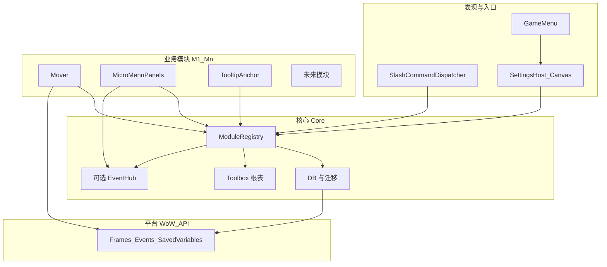
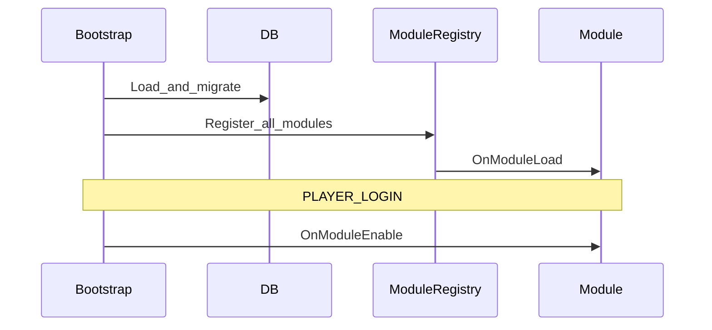

# 魔兽世界正式服 · 工具箱插件技术方案

本文档汇总当前共识，作为实现与扩展的单一事实来源（随开发可修订版本号与细节）。

---

## 1. 目标与范围

| 维度 | 说明 |
|------|------|
| **定位** | 单插件「工具箱」：统一入口、可扩展模块、统一存档与设置 UI。 |
| **客户端** | **仅正式服（Retail）**，以 `Settings` API 与当前 Interface 版本为准。 |
| **初版能力** | ① 自有窗口自由拖动与位置记忆；② ESC 游戏菜单 + 系统「选项」中的插件类目入口；③ **仅**右下角微型菜单 **打开后的主窗口** 可拖动与记忆（**不**移动微型按钮条本身）；④ Tooltip 锚点（如跟随鼠标，见模块 **TooltipAnchor**）。 |
| **扩展方式** | 新功能 = 新模块文件 + `RegisterModule` + TOC 加载顺序；核心保持稳定，业务只增模块。 |

---

## 2. 整体架构（鸟瞰）

```
Core（薄层）
├── 根命名空间（如 Toolbox）
├── SavedVariables 加载 / 版本迁移
├── **Chat（领域对外 API）** — 默认聊天框输出、TOC 元数据读取；见 `Core/Chat.lua`
├── **Tooltip（领域对外 API）** — `GameTooltip_SetDefaultAnchor` hook 与光标锚点；见 `Core/Tooltip.lua`
├── ModuleRegistry（注册、排序、生命周期）
└── 可选：轻量事件（模块增多后再评估 EventHub）

Modules（平级业务，持续增加）
├── Mover — 插件自有 Frame
├── MicroMenuPanels — 微型菜单打开的面板（白名单拖动）
├── TooltipAnchor — GameTooltip 等锚点/跟随鼠标
└── （另见）SavedInstancesEJ — 冒险手册界面增强（如「仅坐骑」勾选）；**非** `RegisterModule`，由 `Bootstrap` 注册

UI
├── SettingsHost — Retail Canvas 类目壳，聚合各模块 RegisterSettings
└── GameMenu — 按钮 → Settings.OpenToCategory（与选项中入口一致）
```

**原则**：可扩展能力经 `RegisterModule` 进入；持久化落在 `ToolboxDB.modules[moduleId]`；设置只通过各模块向 Settings 宿主登记子区域。

**代码注释**：新增/修改的 Lua 须含文件头与关键逻辑注释（动机、暴雪限制、Frame 名与数据键）；**注释使用简体中文**；细则见 [AGENTS.md](../AGENTS.md)。

**全球化（界面文案）**：玩家可见字符串集中在 [Toolbox/Core/Locales.lua](../Toolbox/Core/Locales.lua)，按 `GetLocale()` 在 `enUS` 与 `zhCN`（及 `zhTW` 暂跟简体）间切换；模块注册使用 `nameKey` 指向 `Toolbox.L` 键名，设置界面与 `RegisterCanvasLayoutCategory` 标题均走 `Toolbox.L`。

---

## 2.1 通用架构：分层与扩展点

面向「不断加新功能」，约定四层，依赖只允许 **自上而下**（上层依赖下层，同层模块不互相 `require` 实现细节，而通过 **核心 API + 可选事件** 协作）。



| 层级 | 职责 | 稳定性 |
|------|------|--------|
| **平台** | Blizzard API，不封装成全量抽象，仅在模块内直接使用 | 随版本变 |
| **核心** | 命名空间、SV、迁移、`RegisterModule`、生命周期、（可选）事件 | **尽量少改** |
| **模块** | 单一业务域，可启用/禁用、自有子配置 | **主要增量在这里** |
| **表现** | 统一设置壳、GameMenu、Slash 分发，不包含业务判断 | 随入口 API 偶发调整 |

**Lua 实现约定**：文件路径与 TOC、优先 `local`、注释与对外接口文档、`ToolboxDB` 键边界、`pcall` 与 `nil` 等编码细则，以仓库根 **[AGENTS.md](../AGENTS.md)** 中 **「Lua 开发规范」** 为准；本节只描述架构分层，不重复上述条款。

**核心扩展点（新功能应挂接的位置）**

| 扩展点 | 用途 | 约定 |
|--------|------|------|
| `RegisterModule(def)` | 接入新业务能力 | 必须提供稳定 `id`；禁止在 def 里写死其他模块全局 |
| `ToolboxDB.modules[id]` | 模块私有数据 | 键名由模块独占；跨模块共享数据走明确 API 或后续 EventHub |
| `RegisterSettings` | 在系统设置里增加一块 UI | 只注册控件/布局，不假设宿主内部 DOM |
| Slash 分发器 | `/toolbox` 子命令 | 模块可注册 `subcommands["foo"] = handler`，避免每个模块抢一个全局 slash |
| `hooksecurefunc` 等 | 模块内部自行使用；**Tooltip 默认锚点**已集中在 `Core/Tooltip.lua` | 与领域对外 API 重复的 hook 应经 `Toolbox.Tooltip` 统一提供；其它仍可在模块内使用 |

**领域对外 API（与 [AGENTS.md](../AGENTS.md) 一致）**

| 领域对外 API | 文件 | 职责 |
|------|------|------|
| `Toolbox.Chat` | `Core/Chat.lua` | 面向玩家的默认聊天框输出（`PrintAddonMessage`）、插件 TOC 元数据（`GetAddOnMetadata`）。**模块内禁止**直接调用 `DEFAULT_CHAT_FRAME:AddMessage`；新增聊天类能力须先扩展本 API。 |
| `Toolbox.Tooltip` | `Core/Tooltip.lua` | `InstallDefaultAnchorHook()`、`RefreshDriver()`；读取 `modules.tooltip_anchor`。**模块 tooltip_anchor** 仅负责 `RegisterModule` 与设置 UI，不直接 `hooksecurefunc` GameTooltip。 |
| `Toolbox.Lockouts` | `Core/Lockouts.lua` | 锁定列表：`GetNumSavedInstances` / `GetSavedInstanceInfo` 等封装（至暗之夜仍以此为主流 API，便于日后替换）。 |
| `Toolbox.EJ` | `Core/EncounterJournal.lua` | **优先 `C_EncounterJournal`**，兜底时再考虑全局 `EJ_*`；业务模块禁止直接调用 `EJ_*`。 |
| `Toolbox.MountJournal` | `Core/MountJournal.lua` | `C_MountJournal`（坐骑物品、是否已学会）。 |
| `Toolbox.Item` | `Core/Item.lua` | 物品名/链接、`GameTooltip:SetItemByID` 等展示辅助。 |
| `Toolbox.Map` | `Core/Map.lua` | `C_Map.OpenWorldMap` 优先。 |

**模块间协作原则**

- **默认零耦合**：新模块不 import 其他模块文件；若 A 依赖 B 的「结果」，优先 **依赖注入顺序**（`dependencies`）+ B 在 `Toolbox` 上暴露少量函数（如 `Toolbox.Mover:GetFrameRegistry()`），仍由核心在注册阶段绑定。
- **可选 EventHub**：当出现「多个模块要响应同一事实」（例如「全局 UI 缩放变更」）时，由核心提供 `Toolbox:Emit(name, payload)` / `Subscribe`，**第一版可不实现**，避免过度设计。

**模块类型（便于评审新需求落在哪一类）**

| 类型 | 特征 | 示例 |
|------|------|------|
| **自有 UI** | 只操作插件创建的 Frame | Mover 等 |
| **暴雪 UI 适配** | 白名单 Frame + Hook + 战斗中谨慎 | MicroMenuPanels、TooltipAnchor |
| **纯逻辑/数据** | 无窗体或仅有轻量提示 | 未来：统计、导出配置 |

**生命周期（统一顺序）**

1. `ADDON_LOADED`：加载 DB 默认值 → 迁移 → `ModuleRegistry` 收集全部 `RegisterModule`。
2. 按 `dependencies` **拓扑排序**，依次调用各模块 `OnModuleLoad`。
3. `PLAYER_LOGIN`（或等价）后依次 `OnModuleEnable`。
4. `Settings` 类目在 `OnModuleLoad` 阶段由各模块 `RegisterSettings` 向宿主 **登记**，宿主在首次打开前构建子区域。



**版本与兼容**

- **全局 `ToolboxDB.version`**：结构大变时递增；迁移函数集中在 `Core/DB.lua`。
- **模块内可设 `schemaVersion`**（存在 `modules[id].schemaVersion`）：模块自身大改时自行迁移子表，避免动全局版本过于频繁。

---

## 2.2 现有功能与模块映射

| 能力 | 模块 id（建议） | 数据 | 设置 |
|------|-----------------|------|------|
| 自有窗口拖动 | `mover` | `modules.mover` | 全局/每框体开关与重置 |
| 微型菜单面板拖动 | `micromenu_panels` | `modules.micromenu_panels` | 总开关、按面板重置、维护说明 |
| Tooltip 锚点 | `tooltip_anchor` | `modules.tooltip_anchor` | 模式：默认/光标锚点/持续跟随、偏移 |
| 加载聊天提示 | `chat_notify` | `modules.chat_notify` | 是否在加载完成后向默认聊天框输出一行 |
| 冒险手册界面增强（仅坐骑筛选等） | （`SavedInstancesEJ.lua`，**非** `RegisterModule`） | — | 无独立 `modules.*` 默认块；逻辑见该文件 |
| （核心不提供业务数据） | — | `global` | 调试、开发者选项可放 `global` |

新增功能时：**新增一行 + 新文件 + TOC 一条**，不必改核心契约。

---

## 3. 数据模型（SavedVariables）

单表建议结构：

```lua
ToolboxDB = {
  version = <number>,   -- 全局迁移版本
  global = { debug = false, locale = "auto" },  -- locale：auto | zhCN | enUS，见 Locales.lua
  modules = {
    mover = { ... },
    micromenu_panels = { ... },
    tooltip_anchor = { ... },
    chat_notify = { ... },
  },
}
```

- 各模块 **只读写** `ToolboxDB.modules.<自身 id>`，避免键冲突。
- 大版本或结构变更时递增 `version`，在核心内做迁移函数表。
- **旧存档**：可能含已下线模块的键；`Core/DB.lua` 的 `defaults` 仅描述当前版本默认形状，合并时不强制删除用户表中多余键。

---

## 4. 模块契约（RegisterModule）

每个模块建议提供：

| 字段 | 说明 |
|------|------|
| `id` | 稳定字符串，作 DB 键与设置子区 id |
| `name` | 可选，固定显示名（不推荐；优先 `nameKey`） |
| `nameKey` | 可选，`Toolbox.L` 中的键，用于设置页模块标题（多语言） |
| `dependencies` | 可选，模块 id 列表；核心按拓扑排序初始化 |
| `OnModuleLoad` | 不依赖角色数据的初始化 |
| `OnModuleEnable` | `PLAYER_LOGIN` 后执行（读角色、应用 UI） |
| `RegisterSettings` | 向 Settings 宿主注册本模块配置 UI |
| `settingsGroupId` | 可选，设置页折叠分组：`general` / `ui_windows` / `tooltip` / `misc`（缺省 `misc`）；见 spec §B |
| `OnProfileChanged` | 可选 |

---

## 5. 功能方案分述

### 5.1 设置与 ESC 入口（Retail）

- 使用 **`Settings.RegisterCanvasLayoutCategory` + `Settings.RegisterAddOnCategory`** 注册插件类目。
- **游戏菜单**：在 `GameMenuFrame` 上增加按钮，点击调用 **`Settings.OpenToCategory(categoryID)`**，与 **ESC → 选项 → 插件** 中打开的界面一致；挂载时机见 **`Toolbox.GameMenu_Init`**（`ADDON_LOADED`、`PLAYER_ENTERING_WORLD`、`OnShow`），不以固定秒数延迟为主路径。
- 提供 **`/toolbox`**（或约定 slash）便于调试与无菜单时打开。
- **设置页分组（可折叠）**：`ToolboxDB.global.settingsGroupsExpanded`、分组顺序与文案见 **[specs/2026-04-02-design-workflow-and-settings-groups.md](./specs/2026-04-02-design-workflow-and-settings-groups.md)** §B；模块通过 `settingsGroupId` 归入分组。

### 5.2 自有窗口拖动（Mover）

- 对插件创建的 `Frame`：`SetMovable(true)`、`RegisterForDrag`、存盘键与 `ToolboxDB.modules.mover` 对应。
- 拖动建议绑在 **标题栏或专用手柄**，避免与窗体内按钮抢拖动；可配置战斗中禁止拖动（视框体是否含安全逻辑而定）。

### 5.3 微型菜单打开的面板（MicroMenuPanels）

| 项 | 说明 |
|----|------|
| **目标** | 仅 **打开后的主窗口** 可拖动与位置记忆；**不包含**右下角微型按钮条本身。 |
| **实现** | 维护 **白名单**（各面板顶层 Frame 名）；`SetMovable` + `RegisterForDrag`；**Hook `OnShow`**（或等价）在暴雪重置后再次应用。 |
| **名单** | 角色、法术书、天赋、成就、任务、公会、收藏、地下城查找器、冒险指南、商店等，以 **实机 `/fstack` 与当前版本 API** 为准，随补丁更新维护。 |
| **战斗** | 尽量避免在战斗中修改安全相关行为；可减少 taint 与报错。 |

### 5.4 Tooltip 锚点（TooltipAnchor + `Toolbox.Tooltip`）

| 项 | 说明 |
|----|------|
| **目标** | 调整 `GameTooltip` / `ItemRefTooltip` 相对鼠标的显示方式（贴近光标、显示期间跟随；锚在光标右下等）。 |
| **领域对外 API** | `Core/Tooltip.lua`：`InstallDefaultAnchorHook()`（`hooksecurefunc("GameTooltip_SetDefaultAnchor", ...)`）、`RefreshDriver()`（跟随用 `OnUpdate`）。**勿在 OnUpdate 里 `SetOwner`**，否则会清空提示文字。 |
| **模块** | `tooltip_anchor`：设置 UI 与存档键；调用 `Toolbox.Tooltip` 的 `InstallDefaultAnchorHook` / `RefreshDriver`。 |
| **注意** | `UIParent:GetEffectiveScale()`；与暴雪「界面·鼠标」类选项可能叠加。 |

### 5.5 聊天（Chat）领域对外 API 与加载提示（chat_notify）

| 项 | 说明 |
|----|------|
| **领域对外 API** | `Toolbox.Chat`（`Core/Chat.lua`）：`PrintAddonMessage(body)`、`GetAddOnMetadata(name, field)`。 |
| **模块** | `chat_notify`：是否输出、旧档迁移、`Locales` 文案键；`PrintLoadComplete()` 组装正文后调用 `Toolbox.Chat.PrintAddonMessage`。 |
| **调用时机** | `Core/Bootstrap.lua` 在 `ADDON_LOADED` 主流程末尾（DB、语言、模块 OnModuleLoad、设置 UI、斜杠注册之后）调用 `PrintLoadComplete()`，避免 `OnModuleLoad` + `C_Timer` 间接触发。 |

---

## 6. TOC 与加载顺序（建议）

1. `Core/Namespace.lua` — 根表  
2. `Core/Locales.lua` — `Toolbox.L` 多语言（须在 Settings 与 Modules 之前）  
3. `Core/DB.lua` — 默认表、迁移  
4. `Core/Chat.lua` — 聊天领域对外 API  
5. `Core/Tooltip.lua` — 提示框领域对外 API（须在 `Modules/TooltipAnchor.lua` 之前）  
6. `Core/ModuleRegistry.lua`  
7. `UI/SettingsHost.lua`  
8. `Modules/Mover.lua`、`Modules/MicroMenuPanels.lua`、`Modules/TooltipAnchor.lua`、`Modules/ChatNotify.lua`（顺序可按依赖微调）  
9. `Core/Bootstrap.lua` — `ADDON_LOADED` 中初始化并启用模块  

`## Interface:` 与正式服客户端一致，大版本后更新。

---

## 7. 里程碑建议

1. TOC + Bootstrap + `ToolboxDB` + `/toolbox` + 空 Settings 类目可打开。  
2. Mover：示例自有面板可拖、可存。  
3. GameMenu 按钮跳转同一类目。  
4. MicroMenuPanels：白名单首批面板 + 存盘 + 设置中开关/重置。  
5. TooltipAnchor：默认锚点 Hook + 设置项（模式与偏移）；按需加 ShoppingTooltip。

---

## 8. 风险与边界

- **不承诺**移动「所有」暴雪 UI；本方案仅 **微型菜单打开的面板白名单**。  
- **世界距离、Tab 目标、姓名板射线** 等不在本插件能力范围内（非本插件目标）。  
- 暴雪重命名 Frame 时需更新白名单；建议在设置中提供「本模块版本说明」或调试日志。

---

## 9. 文档修订

| 日期 | 修订内容 |
|------|----------|
| 2026-04-01 | 初稿：Retail、框架、四块能力、微型菜单仅面板不拖按钮 |
| 2026-04-01 | 通用可扩展架构：分层、扩展点、生命周期、模块映射；增加 TooltipAnchor 与里程碑 |
| 2026-04-01 | 代码注释约束：见 AGENTS.md；总设计「原则」下增加链接 |
| 2026-04-01 | Locales.lua 全球化；注释限定中文；模块 nameKey；TOC 插入 Locales |
| 2026-04-02 | 领域对外 API `Toolbox.Chat`（Core/Chat.lua）；chat_notify 仅经 `Toolbox.Chat`；TOC 与 §5.6 补充 |
| 2026-04-02 | 领域对外 API `Toolbox.Tooltip`（Core/Tooltip.lua）；tooltip_anchor 变薄；MicroMenuPanels 统一 `getMicroMenuDb()` |
| 2026-04-02 | Core 下锁定/手册/坐骑/物品/地图分别置于 `Lockouts.lua`、`EncounterJournal.lua`、`MountJournal.lua`、`Item.lua`、`Map.lua`；物品对外 API 为 `Toolbox.Item`；文档用语统一为「领域对外 API」 |
| 2026-04-02 | §5.1 指向 `specs/2026-04-02-design-workflow-and-settings-groups.md`（协作节奏 + 设置页可折叠分组设计草案） |
| 2026-04-02 | §2.1 增加对 [AGENTS.md](../AGENTS.md)「Lua 开发规范」的引用 |
| 2026-04-02 | 鸟瞰图与 §2.2、§3：移除已不存在的 `saved_instances` 模块描述；改为 `SavedInstancesEJ`（非 RegisterModule）；§3 示例与旧存档说明 |
